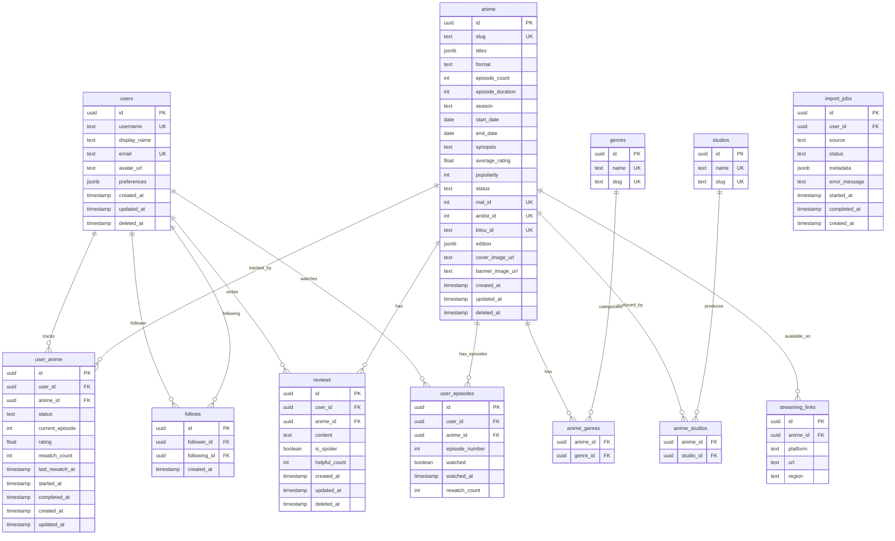

# STREAMD Technical Specification

> Engineering blueprint for the anime tracking platform

**Version:** 1.0.0
**Last Updated:** December 24, 2024

---

## Table of Contents

1. [System Architecture Overview](#1-system-architecture-overview)
2. [Database Schema](#2-database-schema)
3. [Type Definitions](#3-type-definitions)
4. [Authentication Flow](#4-authentication-flow)
5. [ViewModel Architecture](#5-viewmodel-architecture)
6. [API Design (Server Actions)](#6-api-design-server-actions)
7. [Search Architecture](#7-search-architecture)
8. [Caching Strategy](#8-caching-strategy)
9. [Public Pages & SEO](#9-public-pages--seo)
10. [Background Jobs](#10-background-jobs)
11. [Project Structure](#11-project-structure)
12. [Dependencies](#12-dependencies)
13. [Environment Variables](#13-environment-variables)
14. [Phase Implementation Roadmap](#14-phase-implementation-roadmap)

---

## 1. System Architecture Overview

### High-Level Architecture


### Technology Stack

| Layer            | Technology              | Purpose                          |
| ---------------- | ----------------------- | -------------------------------- |
| Frontend         | Next.js 16 (App Router) | SSR, SSG, Server Actions         |
| State Management | Zustand                 | ViewModel pattern, client state  |
| Database         | Supabase PostgreSQL     | Primary data store               |
| Authentication   | Supabase Auth           | OAuth, email auth, sessions      |
| Search           | Algolia                 | Full-text search, fuzzy matching |
| Cache            | Upstash Redis           | Caching, rate limiting, queues   |
| Object Storage   | Cloudflare R2           | Images, share cards, avatars     |
| Styling          | Tailwind CSS            | Utility-first CSS                |
| Validation       | Zod                     | Runtime type validation          |

### Key Architectural Decisions

1. **Next.js App Router with Server Actions** - Eliminates need for separate API layer, provides type-safe server-client communication
2. **Supabase for Auth + Database** - Managed PostgreSQL with built-in auth, RLS, and realtime subscriptions
3. **Zustand for State Management** - Lightweight, TypeScript-first state management implementing ViewModel pattern
4. **Algolia for Search** - Fast, typo-tolerant search with 10K free searches/month
5. **Upstash Redis** - Serverless Redis for caching and background job queues

---

## 2. Database Schema

### Entity Relationship Diagram



### SQL Schema Definitions

#### Users Table (extends Supabase auth.users)

```sql
-- Users profile table (extends auth.users)
CREATE TABLE public.users (
    id UUID PRIMARY KEY REFERENCES auth.users(id) ON DELETE CASCADE,
    username TEXT UNIQUE NOT NULL,
    display_name TEXT,
    email TEXT UNIQUE NOT NULL,
    avatar_url TEXT,
    preferences JSONB DEFAULT '{}'::jsonb,
    created_at TIMESTAMPTZ DEFAULT NOW() NOT NULL,
    updated_at TIMESTAMPTZ DEFAULT NOW() NOT NULL,
    deleted_at TIMESTAMPTZ,

    CONSTRAINT username_length CHECK (char_length(username) >= 3 AND char_length(username) <= 30),
    CONSTRAINT username_format CHECK (username ~ '^[a-zA-Z0-9_]+$')
);

-- Index for username lookups
CREATE INDEX idx_users_username ON public.users(username);
CREATE INDEX idx_users_deleted_at ON public.users(deleted_at) WHERE deleted_at IS NULL;

-- RLS Policies
ALTER TABLE public.users ENABLE ROW LEVEL SECURITY;

-- Anyone can view non-deleted user profiles
CREATE POLICY "Public profiles are viewable by everyone"
    ON public.users FOR SELECT
    USING (deleted_at IS NULL);

-- Users can update their own profile
CREATE POLICY "Users can update own profile"
    ON public.users FOR UPDATE
    USING (auth.uid() = id)
    WITH CHECK (auth.uid() = id);

-- Users can soft delete their own profile
CREATE POLICY "Users can delete own profile"
    ON public.users FOR DELETE
    USING (auth.uid() = id);
```

#### Anime Table

```sql
-- Anime table
CREATE TABLE public.anime (
    id UUID PRIMARY KEY DEFAULT gen_random_uuid(),
    slug TEXT UNIQUE NOT NULL,
    titles JSONB NOT NULL DEFAULT '{}'::jsonb,
    -- titles structure: { "english": string | null, "romaji": string, "japanese": string | null }
    format TEXT NOT NULL CHECK (format IN ('TV', 'MOVIE', 'OVA', 'ONA', 'SPECIAL', 'MUSIC')),
    episode_count INT,
    episode_duration INT, -- in minutes
    season TEXT CHECK (season IN ('WINTER', 'SPRING', 'SUMMER', 'FALL')),
    season_year INT,
    start_date DATE,
    end_date DATE,
    synopsis TEXT,
    average_rating DECIMAL(3, 2) CHECK (average_rating >= 0 AND average_rating <= 10),
    popularity INT DEFAULT 0,
    status TEXT NOT NULL CHECK (status IN ('FINISHED', 'RELEASING', 'NOT_YET_RELEASED', 'CANCELLED', 'HIATUS')),
    -- External IDs as separate columns for efficient querying
    mal_id INT UNIQUE,           -- MyAnimeList ID
    anilist_id INT UNIQUE,       -- AniList ID
    kitsu_id TEXT UNIQUE,        -- Kitsu ID (slug-based)
    edition JSONB DEFAULT '{}'::jsonb,
    -- edition structure: { "type": "TV" | "DIRECTORS_CUT" | "THEATRICAL", "parent_id": uuid | null }
    cover_image_url TEXT,
    banner_image_url TEXT,
    created_at TIMESTAMPTZ DEFAULT NOW() NOT NULL,
    updated_at TIMESTAMPTZ DEFAULT NOW() NOT NULL,
    deleted_at TIMESTAMPTZ,

    CONSTRAINT slug_format CHECK (slug ~ '^[a-z0-9-]+$')
);

-- Indexes
CREATE INDEX idx_anime_slug ON public.anime(slug);
CREATE INDEX idx_anime_status ON public.anime(status);
CREATE INDEX idx_anime_format ON public.anime(format);
CREATE INDEX idx_anime_season ON public.anime(season, season_year);
CREATE INDEX idx_anime_popularity ON public.anime(popularity DESC);
CREATE INDEX idx_anime_rating ON public.anime(average_rating DESC NULLS LAST);
CREATE INDEX idx_anime_deleted_at ON public.anime(deleted_at) WHERE deleted_at IS NULL;
CREATE INDEX idx_anime_titles_gin ON public.anime USING GIN (titles);
-- External ID indexes (unique constraints already create indexes, but explicit for clarity)
CREATE INDEX idx_anime_mal_id ON public.anime(mal_id) WHERE mal_id IS NOT NULL;
CREATE INDEX idx_anime_anilist_id ON public.anime(anilist_id) WHERE anilist_id IS NOT NULL;
CREATE INDEX idx_anime_kitsu_id ON public.anime(kitsu_id) WHERE kitsu_id IS NOT NULL;

-- RLS Policies
ALTER TABLE public.anime ENABLE ROW LEVEL SECURITY;

-- Anyone can view non-deleted anime
CREATE POLICY "Anime is viewable by everyone"
    ON public.anime FOR SELECT
    USING (deleted_at IS NULL);

-- Only authenticated users can insert (admin check would be added)
CREATE POLICY "Authenticated users can insert anime"
    ON public.anime FOR INSERT
    WITH CHECK (auth.role() = 'authenticated');

-- Only authenticated users can update (admin check would be added)
CREATE POLICY "Authenticated users can update anime"
    ON public.anime FOR UPDATE
    USING (auth.role() = 'authenticated');
```

#### User Anime (Tracking) Table

```sql
-- User anime tracking table
CREATE TABLE public.user_anime (
    id UUID PRIMARY KEY DEFAULT gen_random_uuid(),
    user_id UUID NOT NULL REFERENCES public.users(id) ON DELETE CASCADE,
    anime_id UUID NOT NULL REFERENCES public.anime(id) ON DELETE CASCADE,
    status TEXT NOT NULL CHECK (status IN ('PLANNING', 'WATCHING', 'COMPLETED', 'PAUSED', 'DROPPED')),
    current_episode INT DEFAULT 0 CHECK (current_episode >= 0),
    rating DECIMAL(3, 2) CHECK (rating >= 0 AND rating <= 10),
    rewatch_count INT DEFAULT 0 CHECK (rewatch_count >= 0),
    last_rewatch_at TIMESTAMPTZ,
    started_at DATE,
    completed_at DATE,
    notes TEXT,
    is_private BOOLEAN DEFAULT FALSE,
    created_at TIMESTAMPTZ DEFAULT NOW() NOT NULL,
    updated_at TIMESTAMPTZ DEFAULT NOW() NOT NULL,

    UNIQUE(user_id, anime_id)
);

-- Indexes
CREATE INDEX idx_user_anime_user_id ON public.user_anime(user_id);
CREATE INDEX idx_user_anime_anime_id ON public.user_anime(anime_id);
CREATE INDEX idx_user_anime_status ON public.user_anime(user_id, status);
CREATE INDEX idx_user_anime_updated ON public.user_anime(user_id, updated_at DESC);

-- RLS Policies
ALTER TABLE public.user_anime ENABLE ROW LEVEL SECURITY;

-- Users can view their own tracking data
CREATE POLICY "Users can view own tracking"
    ON public.user_anime FOR SELECT
    USING (auth.uid() = user_id);

-- Public tracking is viewable by everyone (when not private)
CREATE POLICY "Public tracking is viewable"
    ON public.user_anime FOR SELECT
    USING (is_private = FALSE);

-- Users can insert their own tracking
CREATE POLICY "Users can insert own tracking"
    ON public.user_anime FOR INSERT
    WITH CHECK (auth.uid() = user_id);

-- Users can update their own tracking
CREATE POLICY "Users can update own tracking"
    ON public.user_anime FOR UPDATE
    USING (auth.uid() = user_id)
    WITH CHECK (auth.uid() = user_id);

-- Users can delete their own tracking
CREATE POLICY "Users can delete own tracking"
    ON public.user_anime FOR DELETE
    USING (auth.uid() = user_id);
```

#### Follows Table

```sql
-- Follows table for social graph
CREATE TABLE public.follows (
    id UUID PRIMARY KEY DEFAULT gen_random_uuid(),
    follower_id UUID NOT NULL REFERENCES public.users(id) ON DELETE CASCADE,
    following_id UUID NOT NULL REFERENCES public.users(id) ON DELETE CASCADE,
    created_at TIMESTAMPTZ DEFAULT NOW() NOT NULL,

    UNIQUE(follower_id, following_id),
    CONSTRAINT no_self_follow CHECK (follower_id != following_id)
);

-- Indexes
CREATE INDEX idx_follows_follower ON public.follows(follower_id);
CREATE INDEX idx_follows_following ON public.follows(following_id);

-- RLS Policies
ALTER TABLE public.follows ENABLE ROW LEVEL SECURITY;

-- Anyone can view follows
CREATE POLICY "Follows are viewable by everyone"
    ON public.follows FOR SELECT
    USING (TRUE);

-- Users can follow others
CREATE POLICY "Users can follow"
    ON public.follows FOR INSERT
    WITH CHECK (auth.uid() = follower_id);

-- Users can unfollow
CREATE POLICY "Users can unfollow"
    ON public.follows FOR DELETE
    USING (auth.uid() = follower_id);
```

#### Supporting Tables

```sql
-- Genres table
CREATE TABLE public.genres (
    id UUID PRIMARY KEY DEFAULT gen_random_uuid(),
    name TEXT UNIQUE NOT NULL,
    slug TEXT UNIQUE NOT NULL,

    CONSTRAINT slug_format CHECK (slug ~ '^[a-z0-9-]+$')
);

-- Studios table
CREATE TABLE public.studios (
    id UUID PRIMARY KEY DEFAULT gen_random_uuid(),
    name TEXT UNIQUE NOT NULL,
    slug TEXT UNIQUE NOT NULL,

    CONSTRAINT slug_format CHECK (slug ~ '^[a-z0-9-]+$')
);

-- Anime-Genres junction table
CREATE TABLE public.anime_genres (
    anime_id UUID NOT NULL REFERENCES public.anime(id) ON DELETE CASCADE,
    genre_id UUID NOT NULL REFERENCES public.genres(id) ON DELETE CASCADE,
    PRIMARY KEY (anime_id, genre_id)
);

-- Anime-Studios junction table
CREATE TABLE public.anime_studios (
    anime_id UUID NOT NULL REFERENCES public.anime(id) ON DELETE CASCADE,
    studio_id UUID NOT NULL REFERENCES public.studios(id) ON DELETE CASCADE,
    PRIMARY KEY (anime_id, studio_id)
);

-- Streaming links table
CREATE TABLE public.streaming_links (
    id UUID PRIMARY KEY DEFAULT gen_random_uuid(),
    anime_id UUID NOT NULL REFERENCES public.anime(id) ON DELETE CASCADE,
    platform TEXT NOT NULL CHECK (platform IN ('CRUNCHYROLL', 'FUNIMATION', 'NETFLIX', 'HULU', 'AMAZON', 'HIDIVE', 'OTHER')),
    url TEXT NOT NULL,
    region TEXT DEFAULT 'US',
    created_at TIMESTAMPTZ DEFAULT NOW() NOT NULL
);

CREATE INDEX idx_streaming_links_anime ON public.streaming_links(anime_id);

-- Reviews table
CREATE TABLE public.reviews (
    id UUID PRIMARY KEY DEFAULT gen_random_uuid(),
    user_id UUID NOT NULL REFERENCES public.users(id) ON DELETE CASCADE,
    anime_id UUID NOT NULL REFERENCES public.anime(id) ON DELETE CASCADE,
    content TEXT NOT NULL CHECK (char_length(content) >= 50),
    is_spoiler BOOLEAN DEFAULT FALSE,
    helpful_count INT DEFAULT 0,
    created_at TIMESTAMPTZ DEFAULT NOW() NOT NULL,
    updated_at TIMESTAMPTZ DEFAULT NOW() NOT NULL,
    deleted_at TIMESTAMPTZ,

    UNIQUE(user_id, anime_id)
);

CREATE INDEX idx_reviews_anime ON public.reviews(anime_id) WHERE deleted_at IS NULL;
CREATE INDEX idx_reviews_user ON public.reviews(user_id) WHERE deleted_at IS NULL;

-- RLS for reviews
ALTER TABLE public.reviews ENABLE ROW LEVEL SECURITY;

CREATE POLICY "Reviews are viewable by everyone"
    ON public.reviews FOR SELECT
    USING (deleted_at IS NULL);

CREATE POLICY "Users can create reviews"
    ON public.reviews FOR INSERT
    WITH CHECK (auth.uid() = user_id);

CREATE POLICY "Users can update own reviews"
    ON public.reviews FOR UPDATE
    USING (auth.uid() = user_id);

CREATE POLICY "Users can delete own reviews"
    ON public.reviews FOR DELETE
    USING (auth.uid() = user_id);

-- RLS for genres, studios (public read)
ALTER TABLE public.genres ENABLE ROW LEVEL SECURITY;
ALTER TABLE public.studios ENABLE ROW LEVEL SECURITY;
ALTER TABLE public.anime_genres ENABLE ROW LEVEL SECURITY;
ALTER TABLE public.anime_studios ENABLE ROW LEVEL SECURITY;
ALTER TABLE public.streaming_links ENABLE ROW LEVEL SECURITY;

CREATE POLICY "Genres are viewable by everyone" ON public.genres FOR SELECT USING (TRUE);
CREATE POLICY "Studios are viewable by everyone" ON public.studios FOR SELECT USING (TRUE);
CREATE POLICY "Anime genres are viewable by everyone" ON public.anime_genres FOR SELECT USING (TRUE);
CREATE POLICY "Anime studios are viewable by everyone" ON public.anime_studios FOR SELECT USING (TRUE);
CREATE POLICY "Streaming links are viewable by everyone" ON public.streaming_links FOR SELECT USING (TRUE);
```

#### Episode-Level Tracking (Phase 3)

```sql
-- User episode tracking (Phase 3)
CREATE TABLE public.user_episodes (
    id UUID PRIMARY KEY DEFAULT gen_random_uuid(),
    user_id UUID NOT NULL REFERENCES public.users(id) ON DELETE CASCADE,
    anime_id UUID NOT NULL REFERENCES public.anime(id) ON DELETE CASCADE,
    episode_number INT NOT NULL CHECK (episode_number > 0),
    watched BOOLEAN DEFAULT TRUE,
    watched_at TIMESTAMPTZ DEFAULT NOW(),
    rewatch_count INT DEFAULT 0,

    UNIQUE(user_id, anime_id, episode_number)
);

CREATE INDEX idx_user_episodes_user_anime ON public.user_episodes(user_id, anime_id);

-- RLS Policies
ALTER TABLE public.user_episodes ENABLE ROW LEVEL SECURITY;

CREATE POLICY "Users can view own episodes"
    ON public.user_episodes FOR SELECT
    USING (auth.uid() = user_id);

CREATE POLICY "Users can insert own episodes"
    ON public.user_episodes FOR INSERT
    WITH CHECK (auth.uid() = user_id);

CREATE POLICY "Users can update own episodes"
    ON public.user_episodes FOR UPDATE
    USING (auth.uid() = user_id);

CREATE POLICY "Users can delete own episodes"
    ON public.user_episodes FOR DELETE
    USING (auth.uid() = user_id);
```

#### Import Jobs Table

```sql
-- Import jobs for MAL/AniList imports
CREATE TABLE public.import_jobs (
    id UUID PRIMARY KEY DEFAULT gen_random_uuid(),
    user_id UUID NOT NULL REFERENCES public.users(id) ON DELETE CASCADE,
    source TEXT NOT NULL CHECK (source IN ('MAL', 'ANILIST', 'KITSU')),
    status TEXT NOT NULL CHECK (status IN ('PENDING', 'PROCESSING', 'COMPLETED', 'FAILED')),
    metadata JSONB DEFAULT '{}'::jsonb,
    -- metadata structure: { "total_items": number, "processed_items": number, "file_url": string | null }
    error_message TEXT,
    started_at TIMESTAMPTZ,
    completed_at TIMESTAMPTZ,
    created_at TIMESTAMPTZ DEFAULT NOW() NOT NULL
);

CREATE INDEX idx_import_jobs_user ON public.import_jobs(user_id);
CREATE INDEX idx_import_jobs_status ON public.import_jobs(status);

-- RLS Policies
ALTER TABLE public.import_jobs ENABLE ROW LEVEL SECURITY;

CREATE POLICY "Users can view own imports"
    ON public.import_jobs FOR SELECT
    USING (auth.uid() = user_id);

CREATE POLICY "Users can create imports"
    ON public.import_jobs FOR INSERT
    WITH CHECK (auth.uid() = user_id);
```

#### Database Functions and Triggers

```sql
-- Function to update updated_at timestamp
CREATE OR REPLACE FUNCTION update_updated_at_column()
RETURNS TRIGGER AS $$
BEGIN
    NEW.updated_at = NOW();
    RETURN NEW;
END;
$$ LANGUAGE plpgsql;

-- Apply to all tables with updated_at
CREATE TRIGGER update_users_updated_at
    BEFORE UPDATE ON public.users
    FOR EACH ROW EXECUTE FUNCTION update_updated_at_column();

CREATE TRIGGER update_anime_updated_at
    BEFORE UPDATE ON public.anime
    FOR EACH ROW EXECUTE FUNCTION update_updated_at_column();

CREATE TRIGGER update_user_anime_updated_at
    BEFORE UPDATE ON public.user_anime
    FOR EACH ROW EXECUTE FUNCTION update_updated_at_column();

CREATE TRIGGER update_reviews_updated_at
    BEFORE UPDATE ON public.reviews
    FOR EACH ROW EXECUTE FUNCTION update_updated_at_column();

-- Function to create user profile on signup
CREATE OR REPLACE FUNCTION public.handle_new_user()
RETURNS TRIGGER AS $$
BEGIN
    INSERT INTO public.users (id, email, username, display_name)
    VALUES (
        NEW.id,
        NEW.email,
        -- Generate temporary username from email
        LOWER(SPLIT_PART(NEW.email, '@', 1)) || '_' || SUBSTR(NEW.id::text, 1, 8),
        COALESCE(NEW.raw_user_meta_data->>'full_name', SPLIT_PART(NEW.email, '@', 1))
    );
    RETURN NEW;
END;
$$ LANGUAGE plpgsql SECURITY DEFINER;

-- Trigger for new user signup
CREATE TRIGGER on_auth_user_created
    AFTER INSERT ON auth.users
    FOR EACH ROW EXECUTE FUNCTION public.handle_new_user();

-- Function to recalculate anime average rating
CREATE OR REPLACE FUNCTION recalculate_anime_rating()
RETURNS TRIGGER AS $$
BEGIN
    UPDATE public.anime
    SET average_rating = (
        SELECT AVG(rating)
        FROM public.user_anime
        WHERE anime_id = COALESCE(NEW.anime_id, OLD.anime_id)
        AND rating IS NOT NULL
    )
    WHERE id = COALESCE(NEW.anime_id, OLD.anime_id);

    RETURN COALESCE(NEW, OLD);
END;
$$ LANGUAGE plpgsql;

CREATE TRIGGER recalculate_rating_on_change
    AFTER INSERT OR UPDATE OR DELETE ON public.user_anime
    FOR EACH ROW EXECUTE FUNCTION recalculate_anime_rating();
```

---

## 3. Type Definitions

### Database Types (Supabase Generated)

The file `src/types/database.types.ts` is auto-generated by Supabase CLI. Run:

```bash
npx supabase gen types typescript --project-id <project-id> > src/types/database.types.ts
```

### Domain Types

#### `src/types/anime.ts`

```typescript
/**
 * Anime format types
 */
export type AnimeFormat = "TV" | "MOVIE" | "OVA" | "ONA" | "SPECIAL" | "MUSIC";

/**
 * Anime airing status
 */
export type AnimeStatus =
    | "FINISHED"
    | "RELEASING"
    | "NOT_YET_RELEASED"
    | "CANCELLED"
    | "HIATUS";

/**
 * Anime season
 */
export type AnimeSeason = "WINTER" | "SPRING" | "SUMMER" | "FALL";

/**
 * Streaming platform identifiers
 */
export type StreamingPlatform =
    | "CRUNCHYROLL"
    | "FUNIMATION"
    | "NETFLIX"
    | "HULU"
    | "AMAZON"
    | "HIDIVE"
    | "OTHER";

/**
 * External IDs are stored as separate columns for efficient querying
 * - mal_id: MyAnimeList numeric ID
 * - anilist_id: AniList numeric ID
 * - kitsu_id: Kitsu slug-based ID
 */

/**
 * Edition metadata for anime variants
 */
export interface AnimeEdition {
    type: "TV" | "DIRECTORS_CUT" | "THEATRICAL";
    parentId: string | null;
}

/**
 * Anime titles in multiple languages
 */
export interface AnimeTitles {
    english: string | null;
    romaji: string;
    japanese: string | null;
}

/**
 * Core anime entity
 */
export interface Anime {
    id: string;
    slug: string;
    titles: AnimeTitles;
    format: AnimeFormat;
    episodeCount: number | null;
    episodeDuration: number | null;
    season: AnimeSeason | null;
    seasonYear: number | null;
    startDate: string | null;
    endDate: string | null;
    synopsis: string | null;
    averageRating: number | null;
    popularity: number;
    status: AnimeStatus;
    malId: number | null;
    anilistId: number | null;
    kitsuId: string | null;
    edition: AnimeEdition | null;
    coverImageUrl: string | null;
    bannerImageUrl: string | null;
    createdAt: string;
    updatedAt: string;
}

/**
 * Anime with related data (genres, studios)
 */
export interface AnimeWithRelations extends Anime {
    genres: Genre[];
    studios: Studio[];
    streamingLinks: StreamingLink[];
}

/**
 * Genre entity
 */
export interface Genre {
    id: string;
    name: string;
    slug: string;
}

/**
 * Studio entity
 */
export interface Studio {
    id: string;
    name: string;
    slug: string;
}

/**
 * Streaming link entity
 */
export interface StreamingLink {
    id: string;
    animeId: string;
    platform: StreamingPlatform;
    url: string;
    region: string;
}

/**
 * Input type for creating anime
 */
export interface CreateAnimeInput {
    titles: AnimeTitles;
    format: AnimeFormat;
    status: AnimeStatus;
    episodeCount?: number | null;
    episodeDuration?: number | null;
    season?: AnimeSeason | null;
    seasonYear?: number | null;
    startDate?: string | null;
    endDate?: string | null;
    synopsis?: string | null;
    malId?: number | null;
    anilistId?: number | null;
    kitsuId?: string | null;
    coverImageUrl?: string | null;
    bannerImageUrl?: string | null;
    genreIds?: string[];
    studioIds?: string[];
}

/**
 * Input type for updating anime
 */
export interface UpdateAnimeInput extends Partial<CreateAnimeInput> {
    id: string;
}

/**
 * Anime search/filter parameters
 */
export interface AnimeFilters {
    query?: string;
    format?: AnimeFormat[];
    status?: AnimeStatus[];
    season?: AnimeSeason;
    year?: number;
    genres?: string[];
    studios?: string[];
    sortBy?: "popularity" | "rating" | "title" | "startDate";
    sortOrder?: "asc" | "desc";
}
```

#### `src/types/user.ts`

```typescript
/**
 * User tracking status for anime
 */
export type TrackingStatus =
    | "PLANNING"
    | "WATCHING"
    | "COMPLETED"
    | "PAUSED"
    | "DROPPED";

/**
 * Import source for list imports
 */
export type ImportSource = "MAL" | "ANILIST" | "KITSU";

/**
 * Import job status
 */
export type ImportJobStatus = "PENDING" | "PROCESSING" | "COMPLETED" | "FAILED";

/**
 * User preferences stored as JSONB
 */
export interface UserPreferences {
    theme: "light" | "dark" | "system";
    defaultListPrivacy: boolean;
    showAdultContent: boolean;
    emailNotifications: {
        newFollower: boolean;
        listUpdates: boolean;
        recaps: boolean;
    };
}

/**
 * Core user entity
 */
export interface User {
    id: string;
    username: string;
    displayName: string | null;
    email: string;
    avatarUrl: string | null;
    preferences: UserPreferences;
    createdAt: string;
    updatedAt: string;
}

/**
 * Public user profile (excludes sensitive data)
 */
export interface PublicUser {
    id: string;
    username: string;
    displayName: string | null;
    avatarUrl: string | null;
    createdAt: string;
}

/**
 * User with statistics
 */
export interface UserWithStats extends PublicUser {
    stats: UserStats;
}

/**
 * User statistics
 */
export interface UserStats {
    animeCount: number;
    episodesWatched: number;
    daysWatched: number;
    meanScore: number | null;
    completedCount: number;
    watchingCount: number;
    planningCount: number;
    droppedCount: number;
    pausedCount: number;
    followerCount: number;
    followingCount: number;
}

/**
 * User anime tracking entry
 */
export interface UserAnime {
    id: string;
    userId: string;
    animeId: string;
    status: TrackingStatus;
    currentEpisode: number;
    rating: number | null;
    rewatchCount: number;
    lastRewatchAt: string | null;
    startedAt: string | null;
    completedAt: string | null;
    notes: string | null;
    isPrivate: boolean;
    createdAt: string;
    updatedAt: string;
}

/**
 * User anime with anime details
 */
export interface UserAnimeWithDetails extends UserAnime {
    anime: Anime;
}

/**
 * Input for adding anime to list
 */
export interface AddToListInput {
    animeId: string;
    status: TrackingStatus;
    currentEpisode?: number;
    rating?: number | null;
    startedAt?: string | null;
    notes?: string | null;
    isPrivate?: boolean;
}

/**
 * Input for updating tracking entry
 */
export interface UpdateTrackingInput {
    id: string;
    status?: TrackingStatus;
    currentEpisode?: number;
    rating?: number | null;
    startedAt?: string | null;
    completedAt?: string | null;
    notes?: string | null;
    isPrivate?: boolean;
}

/**
 * Follow relationship
 */
export interface Follow {
    id: string;
    followerId: string;
    followingId: string;
    createdAt: string;
}

/**
 * Review entity
 */
export interface Review {
    id: string;
    userId: string;
    animeId: string;
    content: string;
    isSpoiler: boolean;
    helpfulCount: number;
    createdAt: string;
    updatedAt: string;
}

/**
 * Review with user info
 */
export interface ReviewWithUser extends Review {
    user: PublicUser;
}

/**
 * Import job entity
 */
export interface ImportJob {
    id: string;
    userId: string;
    source: ImportSource;
    status: ImportJobStatus;
    metadata: {
        totalItems?: number;
        processedItems?: number;
        fileUrl?: string;
    };
    errorMessage: string | null;
    startedAt: string | null;
    completedAt: string | null;
    createdAt: string;
}
```

#### `src/types/common.ts`

```typescript
/**
 * Standard action result type for Server Actions
 */
export type ActionResult<T> =
    | { success: true; data: T }
    | { success: false; error: string; code?: string };

/**
 * Paginated response wrapper
 */
export interface PaginatedResponse<T> {
    data: T[];
    pagination: {
        page: number;
        pageSize: number;
        totalCount: number;
        totalPages: number;
        hasNextPage: boolean;
        hasPreviousPage: boolean;
    };
}

/**
 * Pagination parameters
 */
export interface PaginationParams {
    page?: number;
    pageSize?: number;
}

/**
 * Sort parameters
 */
export interface SortParams<T extends string = string> {
    sortBy?: T;
    sortOrder?: "asc" | "desc";
}
```

### Zod Validation Schemas

#### `src/lib/validations/anime.ts`

```typescript
import { z } from "zod";

/**
 * Anime format enum schema
 */
export const animeFormatSchema = z.enum([
    "TV",
    "MOVIE",
    "OVA",
    "ONA",
    "SPECIAL",
    "MUSIC",
]);

/**
 * Anime status enum schema
 */
export const animeStatusSchema = z.enum([
    "FINISHED",
    "RELEASING",
    "NOT_YET_RELEASED",
    "CANCELLED",
    "HIATUS",
]);

/**
 * Anime season enum schema
 */
export const animeSeasonSchema = z.enum(["WINTER", "SPRING", "SUMMER", "FALL"]);

/**
 * Anime titles schema
 */
export const animeTitlesSchema = z.object({
    english: z.string().nullable(),
    romaji: z.string().min(1, "Romaji title is required"),
    japanese: z.string().nullable(),
});

/**
 * Create anime input validation schema
 */
export const createAnimeSchema = z.object({
    titles: animeTitlesSchema,
    format: animeFormatSchema,
    status: animeStatusSchema,
    episodeCount: z.number().int().positive().nullable().optional(),
    episodeDuration: z.number().int().positive().nullable().optional(),
    season: animeSeasonSchema.nullable().optional(),
    seasonYear: z.number().int().min(1900).max(2100).nullable().optional(),
    startDate: z.string().datetime().nullable().optional(),
    endDate: z.string().datetime().nullable().optional(),
    synopsis: z.string().max(10000).nullable().optional(),
    malId: z.number().int().positive().nullable().optional(),
    anilistId: z.number().int().positive().nullable().optional(),
    kitsuId: z.string().nullable().optional(),
    coverImageUrl: z.string().url().nullable().optional(),
    bannerImageUrl: z.string().url().nullable().optional(),
    genreIds: z.array(z.string().uuid()).optional(),
    studioIds: z.array(z.string().uuid()).optional(),
});

/**
 * Update anime input validation schema
 */
export const updateAnimeSchema = createAnimeSchema.partial().extend({
    id: z.string().uuid(),
});

/**
 * Anime search filters schema
 */
export const animeFiltersSchema = z.object({
    query: z.string().max(200).optional(),
    format: z.array(animeFormatSchema).optional(),
    status: z.array(animeStatusSchema).optional(),
    season: animeSeasonSchema.optional(),
    year: z.number().int().min(1900).max(2100).optional(),
    genres: z.array(z.string()).optional(),
    studios: z.array(z.string()).optional(),
    sortBy: z.enum(["popularity", "rating", "title", "startDate"]).optional(),
    sortOrder: z.enum(["asc", "desc"]).optional(),
});

export type CreateAnimeInput = z.infer<typeof createAnimeSchema>;
export type UpdateAnimeInput = z.infer<typeof updateAnimeSchema>;
export type AnimeFilters = z.infer<typeof animeFiltersSchema>;
```

#### `src/lib/validations/user.ts`

```typescript
import { z } from "zod";

/**
 * Tracking status enum schema
 */
export const trackingStatusSchema = z.enum([
    "PLANNING",
    "WATCHING",
    "COMPLETED",
    "PAUSED",
    "DROPPED",
]);

/**
 * Username validation schema
 */
export const usernameSchema = z
    .string()
    .min(3, "Username must be at least 3 characters")
    .max(30, "Username must be at most 30 characters")
    .regex(
        /^[a-zA-Z0-9_]+$/,
        "Username can only contain letters, numbers, and underscores",
    );

/**
 * Update user profile schema
 */
export const updateProfileSchema = z.object({
    username: usernameSchema.optional(),
    displayName: z.string().max(100).nullable().optional(),
    avatarUrl: z.string().url().nullable().optional(),
    preferences: z
        .object({
            theme: z.enum(["light", "dark", "system"]).optional(),
            defaultListPrivacy: z.boolean().optional(),
            showAdultContent: z.boolean().optional(),
            emailNotifications: z
                .object({
                    newFollower: z.boolean().optional(),
                    listUpdates: z.boolean().optional(),
                    recaps: z.boolean().optional(),
                })
                .optional(),
        })
        .optional(),
});

/**
 * Add to list input schema
 */
export const addToListSchema = z.object({
    animeId: z.string().uuid(),
    status: trackingStatusSchema,
    currentEpisode: z.number().int().min(0).optional().default(0),
    rating: z.number().min(0).max(10).nullable().optional(),
    startedAt: z.string().datetime().nullable().optional(),
    notes: z.string().max(5000).nullable().optional(),
    isPrivate: z.boolean().optional().default(false),
});

/**
 * Update tracking input schema
 */
export const updateTrackingSchema = z.object({
    id: z.string().uuid(),
    status: trackingStatusSchema.optional(),
    currentEpisode: z.number().int().min(0).optional(),
    rating: z.number().min(0).max(10).nullable().optional(),
    startedAt: z.string().datetime().nullable().optional(),
    completedAt: z.string().datetime().nullable().optional(),
    notes: z.string().max(5000).nullable().optional(),
    isPrivate: z.boolean().optional(),
});

/**
 * Create review schema
 */
export const createReviewSchema = z.object({
    animeId: z.string().uuid(),
    content: z
        .string()
        .min(50, "Review must be at least 50 characters")
        .max(10000),
    isSpoiler: z.boolean().optional().default(false),
});

/**
 * Update review schema
 */
export const updateReviewSchema = z.object({
    id: z.string().uuid(),
    content: z.string().min(50).max(10000).optional(),
    isSpoiler: z.boolean().optional(),
});

export type UpdateProfileInput = z.infer<typeof updateProfileSchema>;
export type AddToListInput = z.infer<typeof addToListSchema>;
export type UpdateTrackingInput = z.infer<typeof updateTrackingSchema>;
export type CreateReviewInput = z.infer<typeof createReviewSchema>;
export type UpdateReviewInput = z.infer<typeof updateReviewSchema>;
```

#### `src/lib/validations/common.ts`

```typescript
import { z } from "zod";

/**
 * Pagination parameters schema
 */
export const paginationSchema = z.object({
    page: z.number().int().min(1).optional().default(1),
    pageSize: z.number().int().min(1).max(100).optional().default(20),
});

/**
 * UUID parameter schema
 */
export const uuidSchema = z.string().uuid();

/**
 * Slug parameter schema
 */
export const slugSchema = z
    .string()
    .regex(/^[a-z0-9-]+$/, "Invalid slug format");

export type PaginationParams = z.infer<typeof paginationSchema>;
```

---

## 4. Authentication Flow

### Authentication Architecture


### Supabase Client Setup

#### `src/lib/supabase/client.ts` (Browser Client)

```typescript
import { createBrowserClient } from "@supabase/ssr";
import type { Database } from "@/types/database.types";

/**
 * Creates a Supabase client for browser-side operations
 * Use this in Client Components
 */
export function createClient() {
    return createBrowserClient<Database>(
        process.env.NEXT_PUBLIC_SUPABASE_URL!,
        process.env.NEXT_PUBLIC_SUPABASE_ANON_KEY!,
    );
}
```

#### `src/lib/supabase/server.ts` (Server Client)

```typescript
import { createServerClient } from "@supabase/ssr";
import { cookies } from "next/headers";
import type { Database } from "@/types/database.types";

/**
 * Creates a Supabase client for server-side operations
 * Use this in Server Components, Server Actions, and Route Handlers
 */
export async function createClient() {
    const cookieStore = await cookies();

    return createServerClient<Database>(
        process.env.NEXT_PUBLIC_SUPABASE_URL!,
        process.env.NEXT_PUBLIC_SUPABASE_ANON_KEY!,
        {
            cookies: {
                getAll() {
                    return cookieStore.getAll();
                },
                setAll(cookiesToSet) {
                    try {
                        cookiesToSet.forEach(({ name, value, options }) =>
                            cookieStore.set(name, value, options),
                        );
                    } catch {
                        // Called from Server Component - ignore
                    }
                },
            },
        },
    );
}
```

#### `src/middleware.ts` (Session Refresh)

```typescript
import { createServerClient } from "@supabase/ssr";
import { NextResponse, type NextRequest } from "next/server";

/**
 * Middleware to refresh Supabase auth session
 * Runs on every request to keep session alive
 */
export async function middleware(request: NextRequest) {
    let supabaseResponse = NextResponse.next({
        request,
    });

    const supabase = createServerClient(
        process.env.NEXT_PUBLIC_SUPABASE_URL!,
        process.env.NEXT_PUBLIC_SUPABASE_ANON_KEY!,
        {
            cookies: {
                getAll() {
                    return request.cookies.getAll();
                },
                setAll(cookiesToSet) {
                    cookiesToSet.forEach(({ name, value }) =>
                        request.cookies.set(name, value),
                    );
                    supabaseResponse = NextResponse.next({
                        request,
                    });
                    cookiesToSet.forEach(({ name, value, options }) =>
                        supabaseResponse.cookies.set(name, value, options),
                    );
                },
            },
        },
    );

    // Refresh session if expired
    const {
        data: { user },
    } = await supabase.auth.getUser();

    // Protect dashboard routes
    if (!user && request.nextUrl.pathname.startsWith("/dashboard")) {
        const url = request.nextUrl.clone();
        url.pathname = "/login";
        url.searchParams.set("redirectTo", request.nextUrl.pathname);
        return NextResponse.redirect(url);
    }

    return supabaseResponse;
}

export const config = {
    matcher: [
        "/((?!_next/static|_next/image|favicon.ico|.*\\.(?:svg|png|jpg|jpeg|gif|webp)$).*)",
    ],
};
```

### OAuth Providers Configuration

Supported providers:

- **Google** - Primary OAuth provider
- **Discord** - Popular in anime community

Configure in Supabase Dashboard > Authentication > Providers.

---

## 5. ViewModel Architecture (Zustand)

The application follows a ViewModel pattern using Zustand stores to separate business logic from UI components.

### Architecture Flow


### ViewModel Pattern Principles

1. **UI components are "dumb"** - They only render state and dispatch actions
2. **Stores contain all business logic** - Validation, transformations, optimistic updates
3. **Server Actions are pure data layer** - No UI concerns, just data operations
4. **Stores call Server Actions directly** - No intermediate service layer

### Store Implementations

#### `src/stores/useUserStore.ts`

```typescript
import { create } from "zustand";
import { persist } from "zustand/middleware";
import type { User, UserPreferences } from "@/types/user";
import type { ActionResult } from "@/types/common";
import { getCurrentUser, updateUserProfile, signOut } from "@/app/actions/user";

/**
 * User store state interface
 */
interface UserState {
    // State
    user: User | null;
    isLoading: boolean;
    isAuthenticated: boolean;
    error: string | null;

    // Actions
    fetchUser: () => Promise<void>;
    updateProfile: (data: Partial<User>) => Promise<ActionResult<User>>;
    updatePreferences: (
        prefs: Partial<UserPreferences>,
    ) => Promise<ActionResult<User>>;
    logout: () => Promise<void>;
    reset: () => void;
}

/**
 * Initial state for reset
 */
const initialState = {
    user: null,
    isLoading: false,
    isAuthenticated: false,
    error: null,
};

/**
 * User store - manages authentication state and user profile
 */
export const useUserStore = create<UserState>()(
    persist(
        (set, get) => ({
            ...initialState,

            /**
             * Fetches the current authenticated user
             */
            fetchUser: async () => {
                set({ isLoading: true, error: null });

                const result = await getCurrentUser();

                if (result.success) {
                    set({
                        user: result.data,
                        isAuthenticated: true,
                        isLoading: false,
                    });
                } else {
                    set({
                        user: null,
                        isAuthenticated: false,
                        isLoading: false,
                        error: result.error,
                    });
                }
            },

            /**
             * Updates the user profile
             */
            updateProfile: async (data) => {
                const { user } = get();
                if (!user) {
                    return { success: false, error: "Not authenticated" };
                }

                // Optimistic update
                set({ user: { ...user, ...data } });

                const result = await updateUserProfile(data);

                if (result.success) {
                    set({ user: result.data });
                } else {
                    // Revert on failure
                    set({ user, error: result.error });
                }

                return result;
            },

            /**
             * Updates user preferences
             */
            updatePreferences: async (prefs) => {
                const { user } = get();
                if (!user) {
                    return { success: false, error: "Not authenticated" };
                }

                const newPreferences = { ...user.preferences, ...prefs };
                return get().updateProfile({
                    preferences: newPreferences,
                } as Partial<User>);
            },

            /**
             * Signs out the user
             */
            logout: async () => {
                await signOut();
                set(initialState);
            },

            /**
             * Resets the store to initial state
             */
            reset: () => set(initialState),
        }),
        {
            name: "user-storage",
            partialize: (state) => ({
                user: state.user,
                isAuthenticated: state.isAuthenticated,
            }),
        },
    ),
);
```

#### `src/stores/useAnimeStore.ts`

```typescript
import { create } from "zustand";
import type { Anime, AnimeWithRelations, AnimeFilters } from "@/types/anime";
import type { ActionResult, PaginatedResponse } from "@/types/common";
import {
    getAnimeById,
    getAnimeBySlug,
    searchAnime,
    createAnime,
    updateAnime,
} from "@/app/actions/anime";

/**
 * Anime store state interface
 */
interface AnimeState {
    // Current anime detail
    currentAnime: AnimeWithRelations | null;
    isLoadingDetail: boolean;
    detailError: string | null;

    // Anime list/search results
    animeList: Anime[];
    isLoadingList: boolean;
    listError: string | null;
    pagination: PaginatedResponse<Anime>["pagination"] | null;

    // Filters
    filters: AnimeFilters;

    // Actions
    fetchAnimeById: (id: string) => Promise<void>;
    fetchAnimeBySlug: (slug: string) => Promise<void>;
    searchAnime: (filters?: AnimeFilters, page?: number) => Promise<void>;
    setFilters: (filters: Partial<AnimeFilters>) => void;
    clearFilters: () => void;
    createAnime: (
        data: Parameters<typeof createAnime>[0],
    ) => Promise<ActionResult<Anime>>;
    updateAnime: (
        data: Parameters<typeof updateAnime>[0],
    ) => Promise<ActionResult<Anime>>;
    clearCurrentAnime: () => void;
    reset: () => void;
}

/**
 * Default filters
 */
const defaultFilters: AnimeFilters = {
    sortBy: "popularity",
    sortOrder: "desc",
};

/**
 * Initial state
 */
const initialState = {
    currentAnime: null,
    isLoadingDetail: false,
    detailError: null,
    animeList: [],
    isLoadingList: false,
    listError: null,
    pagination: null,
    filters: defaultFilters,
};

/**
 * Anime store - manages anime browsing and detail state
 */
export const useAnimeStore = create<AnimeState>((set, get) => ({
    ...initialState,

    /**
     * Fetches anime by ID
     */
    fetchAnimeById: async (id) => {
        set({ isLoadingDetail: true, detailError: null });

        const result = await getAnimeById(id);

        if (result.success) {
            set({ currentAnime: result.data, isLoadingDetail: false });
        } else {
            set({ detailError: result.error, isLoadingDetail: false });
        }
    },

    /**
     * Fetches anime by slug (for SEO-friendly URLs)
     */
    fetchAnimeBySlug: async (slug) => {
        set({ isLoadingDetail: true, detailError: null });

        const result = await getAnimeBySlug(slug);

        if (result.success) {
            set({ currentAnime: result.data, isLoadingDetail: false });
        } else {
            set({ detailError: result.error, isLoadingDetail: false });
        }
    },

    /**
     * Searches anime with filters
     */
    searchAnime: async (filters, page = 1) => {
        const currentFilters = filters || get().filters;
        set({ isLoadingList: true, listError: null, filters: currentFilters });

        const result = await searchAnime(currentFilters, {
            page,
            pageSize: 20,
        });

        if (result.success) {
            set({
                animeList: result.data.data,
                pagination: result.data.pagination,
                isLoadingList: false,
            });
        } else {
            set({ listError: result.error, isLoadingList: false });
        }
    },

    /**
     * Updates filters (does not trigger search)
     */
    setFilters: (filters) => {
        set({ filters: { ...get().filters, ...filters } });
    },

    /**
     * Clears all filters to defaults
     */
    clearFilters: () => {
        set({ filters: defaultFilters });
    },

    /**
     * Creates a new anime entry
     */
    createAnime: async (data) => {
        const result = await createAnime(data);

        if (result.success) {
            // Optionally add to list or refresh
            set((state) => ({
                animeList: [result.data, ...state.animeList],
            }));
        }

        return result;
    },

    /**
     * Updates an existing anime
     */
    updateAnime: async (data) => {
        const result = await updateAnime(data);

        if (result.success) {
            const { currentAnime, animeList } = get();

            // Update current anime if it matches
            if (currentAnime?.id === result.data.id) {
                set({ currentAnime: { ...currentAnime, ...result.data } });
            }

            // Update in list if present
            set({
                animeList: animeList.map((a) =>
                    a.id === result.data.id ? { ...a, ...result.data } : a,
                ),
            });
        }

        return result;
    },

    /**
     * Clears the current anime detail
     */
    clearCurrentAnime: () => {
        set({ currentAnime: null, detailError: null });
    },

    /**
     * Resets the store to initial state
     */
    reset: () => set(initialState),
}));
```

#### `src/stores/useTrackingStore.ts`

```typescript
import { create } from "zustand";
import type {
    UserAnime,
    UserAnimeWithDetails,
    TrackingStatus,
    AddToListInput,
    UpdateTrackingInput,
} from "@/types/user";
import type { ActionResult, PaginatedResponse } from "@/types/common";
import {
    getUserAnimeList,
    addToList,
    updateTracking,
    removeFromList,
    incrementEpisode,
} from "@/app/actions/tracking";

/**
 * Tracking store state interface
 */
interface TrackingState {
    // User&apos;s anime list
    list: UserAnimeWithDetails[];
    isLoading: boolean;
    error: string | null;
    pagination: PaginatedResponse<UserAnimeWithDetails>["pagination"] | null;

    // Current filter
    statusFilter: TrackingStatus | "ALL";

    // Quick lookup map for tracking status
    trackingMap: Map<string, UserAnime>;

    // Actions
    fetchList: (
        status?: TrackingStatus | "ALL",
        page?: number,
    ) => Promise<void>;
    addToList: (input: AddToListInput) => Promise<ActionResult<UserAnime>>;
    updateTracking: (
        input: UpdateTrackingInput,
    ) => Promise<ActionResult<UserAnime>>;
    removeFromList: (id: string) => Promise<ActionResult<void>>;
    incrementEpisode: (id: string) => Promise<ActionResult<UserAnime>>;
    setStatusFilter: (status: TrackingStatus | "ALL") => void;
    getTrackingForAnime: (animeId: string) => UserAnime | undefined;
    reset: () => void;
}

/**
 * Initial state
 */
const initialState = {
    list: [],
    isLoading: false,
    error: null,
    pagination: null,
    statusFilter: "ALL" as const,
    trackingMap: new Map<string, UserAnime>(),
};

/**
 * Tracking store - manages user&apos;s anime list and tracking operations
 */
export const useTrackingStore = create<TrackingState>((set, get) => ({
    ...initialState,

    /**
     * Fetches user&apos;s anime list with optional status filter
     */
    fetchList: async (status = "ALL", page = 1) => {
        set({ isLoading: true, error: null, statusFilter: status });

        const result = await getUserAnimeList(
            status === "ALL" ? undefined : status,
            { page, pageSize: 20 },
        );

        if (result.success) {
            // Build tracking map for quick lookups
            const trackingMap = new Map<string, UserAnime>();
            result.data.data.forEach((item) => {
                trackingMap.set(item.animeId, item);
            });

            set({
                list: result.data.data,
                pagination: result.data.pagination,
                trackingMap,
                isLoading: false,
            });
        } else {
            set({ error: result.error, isLoading: false });
        }
    },

    /**
     * Adds anime to user&apos;s list
     */
    addToList: async (input) => {
        const result = await addToList(input);

        if (result.success) {
            const { trackingMap } = get();
            trackingMap.set(input.animeId, result.data);
            set({ trackingMap: new Map(trackingMap) });

            // Refresh list if viewing relevant status
            const { statusFilter } = get();
            if (statusFilter === "ALL" || statusFilter === input.status) {
                get().fetchList(statusFilter);
            }
        }

        return result;
    },

    /**
     * Updates tracking entry
     */
    updateTracking: async (input) => {
        const { list, trackingMap } = get();

        // Optimistic update
        const existingItem = list.find((item) => item.id === input.id);
        if (existingItem) {
            const optimisticItem = { ...existingItem, ...input };
            set({
                list: list.map((item) =>
                    item.id === input.id ? { ...item, ...input } : item,
                ),
            });
            trackingMap.set(existingItem.animeId, optimisticItem);
            set({ trackingMap: new Map(trackingMap) });
        }

        const result = await updateTracking(input);

        if (!result.success && existingItem) {
            // Revert on failure
            set({ list });
            trackingMap.set(existingItem.animeId, existingItem);
            set({ trackingMap: new Map(trackingMap) });
        }

        return result;
    },

    /**
     * Removes anime from user&apos;s list
     */
    removeFromList: async (id) => {
        const { list, trackingMap } = get();
        const item = list.find((i) => i.id === id);

        // Optimistic removal
        set({ list: list.filter((i) => i.id !== id) });
        if (item) {
            trackingMap.delete(item.animeId);
            set({ trackingMap: new Map(trackingMap) });
        }

        const result = await removeFromList(id);

        if (!result.success) {
            // Revert on failure
            set({ list });
            if (item) {
                trackingMap.set(item.animeId, item);
                set({ trackingMap: new Map(trackingMap) });
            }
        }

        return result;
    },

    /**
     * Increments episode count by 1
     */
    incrementEpisode: async (id) => {
        const { list } = get();
        const item = list.find((i) => i.id === id);

        if (item) {
            // Optimistic update
            const newEpisode = item.currentEpisode + 1;
            set({
                list: list.map((i) =>
                    i.id === id ? { ...i, currentEpisode: newEpisode } : i,
                ),
            });
        }

        const result = await incrementEpisode(id);

        if (!result.success && item) {
            // Revert on failure
            set({ list });
        }

        return result;
    },

    /**
     * Sets the status filter
     */
    setStatusFilter: (status) => {
        set({ statusFilter: status });
    },

    /**
     * Gets tracking info for a specific anime
     */
    getTrackingForAnime: (animeId) => {
        return get().trackingMap.get(animeId);
    },

    /**
     * Resets the store to initial state
     */
    reset: () => set({ ...initialState, trackingMap: new Map() }),
}));
```

#### `src/stores/useSearchStore.ts`

```typescript
import { create } from "zustand";
import type { Anime, AnimeFilters } from "@/types/anime";
import { searchAnime } from "@/app/actions/search";

/**
 * Search store state interface
 */
interface SearchState {
    // Search state
    query: string;
    results: Anime[];
    isSearching: boolean;
    error: string | null;

    // Recent searches (persisted)
    recentSearches: string[];

    // Actions
    search: (query: string) => Promise<void>;
    setQuery: (query: string) => void;
    clearResults: () => void;
    addToRecent: (query: string) => void;
    clearRecent: () => void;
    reset: () => void;
}

/**
 * Maximum recent searches to store
 */
const MAX_RECENT_SEARCHES = 10;

/**
 * Initial state
 */
const initialState = {
    query: "",
    results: [],
    isSearching: false,
    error: null,
    recentSearches: [],
};

/**
 * Search store - manages search queries and results
 */
export const useSearchStore = create<SearchState>((set, get) => ({
    ...initialState,

    /**
     * Performs a search
     */
    search: async (query) => {
        if (!query.trim()) {
            set({ results: [], isSearching: false });
            return;
        }

        set({ query, isSearching: true, error: null });

        const result = await searchAnime({ query });

        if (result.success) {
            set({ results: result.data, isSearching: false });
            get().addToRecent(query);
        } else {
            set({ error: result.error, isSearching: false });
        }
    },

    /**
     * Sets the query without searching
     */
    setQuery: (query) => {
        set({ query });
    },

    /**
     * Clears search results
     */
    clearResults: () => {
        set({ query: "", results: [], error: null });
    },

    /**
     * Adds a query to recent searches
     */
    addToRecent: (query) => {
        const { recentSearches } = get();
        const trimmed = query.trim();

        if (!trimmed) return;

        // Remove if already exists, add to front
        const filtered = recentSearches.filter((s) => s !== trimmed);
        const updated = [trimmed, ...filtered].slice(0, MAX_RECENT_SEARCHES);

        set({ recentSearches: updated });
    },

    /**
     * Clears recent searches
     */
    clearRecent: () => {
        set({ recentSearches: [] });
    },

    /**
     * Resets the store to initial state
     */
    reset: () => set(initialState),
}));
```

#### `src/stores/useSocialStore.ts`

```typescript
import { create } from "zustand";
import type { PublicUser, Follow } from "@/types/user";
import type { ActionResult, PaginatedResponse } from "@/types/common";
import {
    getFollowers,
    getFollowing,
    followUser,
    unfollowUser,
    checkFollowStatus,
} from "@/app/actions/social";

/**
 * Social store state interface
 */
interface SocialState {
    // Followers/Following lists
    followers: PublicUser[];
    following: PublicUser[];
    isLoadingFollowers: boolean;
    isLoadingFollowing: boolean;

    // Follow status cache
    followStatusCache: Map<string, boolean>;

    // Actions
    fetchFollowers: (userId: string, page?: number) => Promise<void>;
    fetchFollowing: (userId: string, page?: number) => Promise<void>;
    follow: (userId: string) => Promise<ActionResult<Follow>>;
    unfollow: (userId: string) => Promise<ActionResult<void>>;
    isFollowing: (userId: string) => Promise<boolean>;
    reset: () => void;
}

/**
 * Initial state
 */
const initialState = {
    followers: [],
    following: [],
    isLoadingFollowers: false,
    isLoadingFollowing: false,
    followStatusCache: new Map<string, boolean>(),
};

/**
 * Social store - manages follows and social features
 */
export const useSocialStore = create<SocialState>((set, get) => ({
    ...initialState,

    /**
     * Fetches followers for a user
     */
    fetchFollowers: async (userId, page = 1) => {
        set({ isLoadingFollowers: true });

        const result = await getFollowers(userId, { page, pageSize: 20 });

        if (result.success) {
            set({ followers: result.data.data, isLoadingFollowers: false });
        } else {
            set({ isLoadingFollowers: false });
        }
    },

    /**
     * Fetches users that a user is following
     */
    fetchFollowing: async (userId, page = 1) => {
        set({ isLoadingFollowing: true });

        const result = await getFollowing(userId, { page, pageSize: 20 });

        if (result.success) {
            set({ following: result.data.data, isLoadingFollowing: false });
        } else {
            set({ isLoadingFollowing: false });
        }
    },

    /**
     * Follows a user
     */
    follow: async (userId) => {
        const result = await followUser(userId);

        if (result.success) {
            const { followStatusCache } = get();
            followStatusCache.set(userId, true);
            set({ followStatusCache: new Map(followStatusCache) });
        }

        return result;
    },

    /**
     * Unfollows a user
     */
    unfollow: async (userId) => {
        const result = await unfollowUser(userId);

        if (result.success) {
            const { followStatusCache } = get();
            followStatusCache.set(userId, false);
            set({ followStatusCache: new Map(followStatusCache) });
        }

        return result;
    },

    /**
     * Checks if current user is following another user
     */
    isFollowing: async (userId) => {
        const { followStatusCache } = get();

        // Check cache first
        if (followStatusCache.has(userId)) {
            return followStatusCache.get(userId)!;
        }

        const result = await checkFollowStatus(userId);

        if (result.success) {
            followStatusCache.set(userId, result.data);
            set({ followStatusCache: new Map(followStatusCache) });
            return result.data;
        }

        return false;
    },

    /**
     * Resets the store to initial state
     */
    reset: () => set({ ...initialState, followStatusCache: new Map() }),
}));
```

### Using ViewModels in Components

#### Example: Anime Detail Page Component

```typescript
'use client';

import { useEffect } from 'react';
import { useAnimeStore } from '@/stores/useAnimeStore';
import { useTrackingStore } from '@/stores/useTrackingStore';

interface AnimeDetailProps {
  slug: string;
}

/**
 * Anime detail component - demonstrates ViewModel usage
 * Component is "dumb" - only renders state and dispatches actions
 */
export function AnimeDetail({ slug }: AnimeDetailProps) {
  // Get state and actions from stores
  const {
    currentAnime,
    isLoadingDetail,
    detailError,
    fetchAnimeBySlug,
  } = useAnimeStore();

  const {
    getTrackingForAnime,
    addToList,
    updateTracking,
  } = useTrackingStore();

  // Fetch anime on mount
  useEffect(() => {
    fetchAnimeBySlug(slug);
  }, [slug, fetchAnimeBySlug]);

  // Get tracking status if user has this anime
  const tracking = currentAnime ? getTrackingForAnime(currentAnime.id) : undefined;

  // Loading state
  if (isLoadingDetail) {
    return <div>Loading...</div>;
  }

  // Error state
  if (detailError) {
    return <div>Error: {detailError}</div>;
  }

  // No data state
  if (!currentAnime) {
    return <div>Anime not found</div>;
  }

  // Handle add to list
  const handleAddToList = async () => {
    await addToList({
      animeId: currentAnime.id,
      status: 'PLANNING',
    });
  };

  // Handle status change
  const handleStatusChange = async (status: TrackingStatus) => {
    if (tracking) {
      await updateTracking({
        id: tracking.id,
        status,
      });
    }
  };

  return (
    <div>
      <h1>{currentAnime.titles.english || currentAnime.titles.romaji}</h1>
      <p>{currentAnime.synopsis}</p>

      {tracking ? (
        <select
          value={tracking.status}
          onChange={(e) => handleStatusChange(e.target.value as TrackingStatus)}
        >
          <option value="PLANNING">Planning</option>
          <option value="WATCHING">Watching</option>
          <option value="COMPLETED">Completed</option>
          <option value="PAUSED">Paused</option>
          <option value="DROPPED">Dropped</option>
        </select>
      ) : (
        <button onClick={handleAddToList}>Add to List</button>
      )}
    </div>
  );
}
```

---

## 6. API Design (Server Actions)

### Server Action Organization

```
src/app/actions/
 anime.ts      # Anime CRUD operations
 tracking.ts   # User anime tracking
 user.ts       # Profile management
 search.ts     # Search operations
 social.ts     # Follow operations
```

### Standard Action Result Pattern

All server actions return a consistent `ActionResult<T>` type:

```typescript
// Success case
{ success: true, data: T }

// Error case
{ success: false, error: string, code?: string }
```

### Action Implementations

#### `src/app/actions/anime.ts`

```typescript
"use server";

import { createClient } from "@/lib/supabase/server";
import {
    createAnimeSchema,
    updateAnimeSchema,
    animeFiltersSchema,
} from "@/lib/validations/anime";
import { paginationSchema } from "@/lib/validations/common";
import type {
    Anime,
    AnimeWithRelations,
    AnimeFilters,
    CreateAnimeInput,
    UpdateAnimeInput,
} from "@/types/anime";
import type {
    ActionResult,
    PaginatedResponse,
    PaginationParams,
} from "@/types/common";
import { generateSlug } from "@/lib/utils/slug";

/**
 * Fetches an anime by ID with all relations
 */
export async function getAnimeById(
    id: string,
): Promise<ActionResult<AnimeWithRelations>> {
    try {
        const supabase = await createClient();

        const { data, error } = await supabase
            .from("anime")
            .select(
                `
        *,
        genres:anime_genres(genre:genres(*)),
        studios:anime_studios(studio:studios(*)),
        streaming_links(*)
      `,
            )
            .eq("id", id)
            .single();

        if (error) {
            return {
                success: false,
                error: "Anime not found",
                code: "NOT_FOUND",
            };
        }

        // Transform the nested data
        const anime = transformAnimeResponse(data);

        return { success: true, data: anime };
    } catch (error) {
        console.error("Error fetching anime:", error);
        return { success: false, error: "Failed to fetch anime" };
    }
}

/**
 * Fetches an anime by slug
 */
export async function getAnimeBySlug(
    slug: string,
): Promise<ActionResult<AnimeWithRelations>> {
    try {
        const supabase = await createClient();

        const { data, error } = await supabase
            .from("anime")
            .select(
                `
        *,
        genres:anime_genres(genre:genres(*)),
        studios:anime_studios(studio:studios(*)),
        streaming_links(*)
      `,
            )
            .eq("slug", slug)
            .single();

        if (error) {
            return {
                success: false,
                error: "Anime not found",
                code: "NOT_FOUND",
            };
        }

        const anime = transformAnimeResponse(data);

        return { success: true, data: anime };
    } catch (error) {
        console.error("Error fetching anime:", error);
        return { success: false, error: "Failed to fetch anime" };
    }
}

/**
 * Searches anime with filters and pagination
 */
export async function searchAnime(
    filters: AnimeFilters,
    pagination: PaginationParams = {},
): Promise<ActionResult<PaginatedResponse<Anime>>> {
    try {
        // Validate inputs
        const validatedFilters = animeFiltersSchema.parse(filters);
        const validatedPagination = paginationSchema.parse(pagination);

        const supabase = await createClient();
        const { page, pageSize } = validatedPagination;
        const offset = (page - 1) * pageSize;

        // Build query
        let query = supabase.from("anime").select("*", { count: "exact" });

        // Apply filters
        if (validatedFilters.format?.length) {
            query = query.in("format", validatedFilters.format);
        }
        if (validatedFilters.status?.length) {
            query = query.in("status", validatedFilters.status);
        }
        if (validatedFilters.season) {
            query = query.eq("season", validatedFilters.season);
        }
        if (validatedFilters.year) {
            query = query.eq("season_year", validatedFilters.year);
        }

        // Apply sorting
        const sortColumn =
            validatedFilters.sortBy === "rating"
                ? "average_rating"
                : validatedFilters.sortBy === "title"
                  ? "titles->romaji"
                  : validatedFilters.sortBy === "startDate"
                    ? "start_date"
                    : "popularity";
        const sortOrder = validatedFilters.sortOrder === "asc" ? true : false;
        query = query.order(sortColumn, {
            ascending: sortOrder,
            nullsFirst: false,
        });

        // Apply pagination
        query = query.range(offset, offset + pageSize - 1);

        const { data, error, count } = await query;

        if (error) {
            return { success: false, error: "Search failed" };
        }

        const totalCount = count || 0;
        const totalPages = Math.ceil(totalCount / pageSize);

        return {
            success: true,
            data: {
                data: data.map(transformAnimeRow),
                pagination: {
                    page,
                    pageSize,
                    totalCount,
                    totalPages,
                    hasNextPage: page < totalPages,
                    hasPreviousPage: page > 1,
                },
            },
        };
    } catch (error) {
        console.error("Error searching anime:", error);
        return { success: false, error: "Search failed" };
    }
}

/**
 * Creates a new anime entry
 */
export async function createAnime(
    input: CreateAnimeInput,
): Promise<ActionResult<Anime>> {
    try {
        const validated = createAnimeSchema.parse(input);
        const supabase = await createClient();

        // Check auth
        const {
            data: { user },
        } = await supabase.auth.getUser();
        if (!user) {
            return {
                success: false,
                error: "Unauthorized",
                code: "UNAUTHORIZED",
            };
        }

        // Generate slug from title
        const slug = generateSlug(validated.titles.romaji);

        const { data, error } = await supabase
            .from("anime")
            .insert({
                slug,
                titles: validated.titles,
                format: validated.format,
                status: validated.status,
                episode_count: validated.episodeCount,
                episode_duration: validated.episodeDuration,
                season: validated.season,
                season_year: validated.seasonYear,
                start_date: validated.startDate,
                end_date: validated.endDate,
                synopsis: validated.synopsis,
                mal_id: validated.malId,
                anilist_id: validated.anilistId,
                kitsu_id: validated.kitsuId,
                cover_image_url: validated.coverImageUrl,
                banner_image_url: validated.bannerImageUrl,
            })
            .select()
            .single();

        if (error) {
            return { success: false, error: "Failed to create anime" };
        }

        // Add genres if provided
        if (validated.genreIds?.length) {
            await supabase.from("anime_genres").insert(
                validated.genreIds.map((genreId) => ({
                    anime_id: data.id,
                    genre_id: genreId,
                })),
            );
        }

        // Add studios if provided
        if (validated.studioIds?.length) {
            await supabase.from("anime_studios").insert(
                validated.studioIds.map((studioId) => ({
                    anime_id: data.id,
                    studio_id: studioId,
                })),
            );
        }

        return { success: true, data: transformAnimeRow(data) };
    } catch (error) {
        console.error("Error creating anime:", error);
        return { success: false, error: "Failed to create anime" };
    }
}

/**
 * Updates an existing anime
 */
export async function updateAnime(
    input: UpdateAnimeInput,
): Promise<ActionResult<Anime>> {
    try {
        const validated = updateAnimeSchema.parse(input);
        const supabase = await createClient();

        // Check auth
        const {
            data: { user },
        } = await supabase.auth.getUser();
        if (!user) {
            return {
                success: false,
                error: "Unauthorized",
                code: "UNAUTHORIZED",
            };
        }

        const { data, error } = await supabase
            .from("anime")
            .update({
                titles: validated.titles,
                format: validated.format,
                status: validated.status,
                episode_count: validated.episodeCount,
                episode_duration: validated.episodeDuration,
                season: validated.season,
                season_year: validated.seasonYear,
                start_date: validated.startDate,
                end_date: validated.endDate,
                synopsis: validated.synopsis,
                mal_id: validated.malId,
                anilist_id: validated.anilistId,
                kitsu_id: validated.kitsuId,
                cover_image_url: validated.coverImageUrl,
                banner_image_url: validated.bannerImageUrl,
            })
            .eq("id", validated.id)
            .select()
            .single();

        if (error) {
            return { success: false, error: "Failed to update anime" };
        }

        return { success: true, data: transformAnimeRow(data) };
    } catch (error) {
        console.error("Error updating anime:", error);
        return { success: false, error: "Failed to update anime" };
    }
}

/**
 * Helper to transform database row to Anime type
 */
function transformAnimeRow(row: Record<string, unknown>): Anime {
    return {
        id: row.id as string,
        slug: row.slug as string,
        titles: row.titles as Anime["titles"],
        format: row.format as Anime["format"],
        episodeCount: row.episode_count as number | null,
        episodeDuration: row.episode_duration as number | null,
        season: row.season as Anime["season"],
        seasonYear: row.season_year as number | null,
        startDate: row.start_date as string | null,
        endDate: row.end_date as string | null,
        synopsis: row.synopsis as string | null,
        averageRating: row.average_rating as number | null,
        popularity: row.popularity as number,
        status: row.status as Anime["status"],
        malId: row.mal_id as number | null,
        anilistId: row.anilist_id as number | null,
        kitsuId: row.kitsu_id as string | null,
        edition: row.edition as Anime["edition"],
        coverImageUrl: row.cover_image_url as string | null,
        bannerImageUrl: row.banner_image_url as string | null,
        createdAt: row.created_at as string,
        updatedAt: row.updated_at as string,
    };
}

/**
 * Helper to transform full anime response with relations
 */
function transformAnimeResponse(
    row: Record<string, unknown>,
): AnimeWithRelations {
    const base = transformAnimeRow(row);
    return {
        ...base,
        genres: (
            (row.genres as Array<{ genre: Record<string, unknown> }>) || []
        ).map((g) => ({
            id: g.genre.id as string,
            name: g.genre.name as string,
            slug: g.genre.slug as string,
        })),
        studios: (
            (row.studios as Array<{ studio: Record<string, unknown> }>) || []
        ).map((s) => ({
            id: s.studio.id as string,
            name: s.studio.name as string,
            slug: s.studio.slug as string,
        })),
        streamingLinks: (
            (row.streaming_links as Array<Record<string, unknown>>) || []
        ).map((l) => ({
            id: l.id as string,
            animeId: l.anime_id as string,
            platform: l.platform as StreamingPlatform,
            url: l.url as string,
            region: l.region as string,
        })),
    };
}
```

#### `src/app/actions/tracking.ts`

```typescript
"use server";

import { createClient } from "@/lib/supabase/server";
import { addToListSchema, updateTrackingSchema } from "@/lib/validations/user";
import { paginationSchema } from "@/lib/validations/common";
import type {
    UserAnime,
    UserAnimeWithDetails,
    TrackingStatus,
    AddToListInput,
    UpdateTrackingInput,
} from "@/types/user";
import type {
    ActionResult,
    PaginatedResponse,
    PaginationParams,
} from "@/types/common";

/**
 * Gets user&apos;s anime list with optional status filter
 */
export async function getUserAnimeList(
    status?: TrackingStatus,
    pagination: PaginationParams = {},
): Promise<ActionResult<PaginatedResponse<UserAnimeWithDetails>>> {
    try {
        const validatedPagination = paginationSchema.parse(pagination);
        const supabase = await createClient();

        // Check auth
        const {
            data: { user },
        } = await supabase.auth.getUser();
        if (!user) {
            return {
                success: false,
                error: "Unauthorized",
                code: "UNAUTHORIZED",
            };
        }

        const { page, pageSize } = validatedPagination;
        const offset = (page - 1) * pageSize;

        let query = supabase
            .from("user_anime")
            .select("*, anime(*)", { count: "exact" })
            .eq("user_id", user.id);

        if (status) {
            query = query.eq("status", status);
        }

        query = query
            .order("updated_at", { ascending: false })
            .range(offset, offset + pageSize - 1);

        const { data, error, count } = await query;

        if (error) {
            return { success: false, error: "Failed to fetch list" };
        }

        const totalCount = count || 0;
        const totalPages = Math.ceil(totalCount / pageSize);

        return {
            success: true,
            data: {
                data: data.map(transformUserAnimeRow),
                pagination: {
                    page,
                    pageSize,
                    totalCount,
                    totalPages,
                    hasNextPage: page < totalPages,
                    hasPreviousPage: page > 1,
                },
            },
        };
    } catch (error) {
        console.error("Error fetching user anime list:", error);
        return { success: false, error: "Failed to fetch list" };
    }
}

/**
 * Adds anime to user&apos;s list
 */
export async function addToList(
    input: AddToListInput,
): Promise<ActionResult<UserAnime>> {
    try {
        const validated = addToListSchema.parse(input);
        const supabase = await createClient();

        // Check auth
        const {
            data: { user },
        } = await supabase.auth.getUser();
        if (!user) {
            return {
                success: false,
                error: "Unauthorized",
                code: "UNAUTHORIZED",
            };
        }

        // Check if already in list
        const { data: existing } = await supabase
            .from("user_anime")
            .select("id")
            .eq("user_id", user.id)
            .eq("anime_id", validated.animeId)
            .single();

        if (existing) {
            return {
                success: false,
                error: "Anime already in list",
                code: "DUPLICATE",
            };
        }

        const { data, error } = await supabase
            .from("user_anime")
            .insert({
                user_id: user.id,
                anime_id: validated.animeId,
                status: validated.status,
                current_episode: validated.currentEpisode || 0,
                rating: validated.rating,
                started_at: validated.startedAt,
                notes: validated.notes,
                is_private: validated.isPrivate || false,
            })
            .select()
            .single();

        if (error) {
            return { success: false, error: "Failed to add to list" };
        }

        return { success: true, data: transformUserAnimeRowSimple(data) };
    } catch (error) {
        console.error("Error adding to list:", error);
        return { success: false, error: "Failed to add to list" };
    }
}

/**
 * Updates a tracking entry
 */
export async function updateTracking(
    input: UpdateTrackingInput,
): Promise<ActionResult<UserAnime>> {
    try {
        const validated = updateTrackingSchema.parse(input);
        const supabase = await createClient();

        // Check auth
        const {
            data: { user },
        } = await supabase.auth.getUser();
        if (!user) {
            return {
                success: false,
                error: "Unauthorized",
                code: "UNAUTHORIZED",
            };
        }

        // Build update object
        const updates: Record<string, unknown> = {};
        if (validated.status !== undefined) updates.status = validated.status;
        if (validated.currentEpisode !== undefined)
            updates.current_episode = validated.currentEpisode;
        if (validated.rating !== undefined) updates.rating = validated.rating;
        if (validated.startedAt !== undefined)
            updates.started_at = validated.startedAt;
        if (validated.completedAt !== undefined)
            updates.completed_at = validated.completedAt;
        if (validated.notes !== undefined) updates.notes = validated.notes;
        if (validated.isPrivate !== undefined)
            updates.is_private = validated.isPrivate;

        const { data, error } = await supabase
            .from("user_anime")
            .update(updates)
            .eq("id", validated.id)
            .eq("user_id", user.id) // Ensure user owns this entry
            .select()
            .single();

        if (error) {
            return { success: false, error: "Failed to update tracking" };
        }

        return { success: true, data: transformUserAnimeRowSimple(data) };
    } catch (error) {
        console.error("Error updating tracking:", error);
        return { success: false, error: "Failed to update tracking" };
    }
}

/**
 * Removes anime from user&apos;s list
 */
export async function removeFromList(id: string): Promise<ActionResult<void>> {
    try {
        const supabase = await createClient();

        // Check auth
        const {
            data: { user },
        } = await supabase.auth.getUser();
        if (!user) {
            return {
                success: false,
                error: "Unauthorized",
                code: "UNAUTHORIZED",
            };
        }

        const { error } = await supabase
            .from("user_anime")
            .delete()
            .eq("id", id)
            .eq("user_id", user.id);

        if (error) {
            return { success: false, error: "Failed to remove from list" };
        }

        return { success: true, data: undefined };
    } catch (error) {
        console.error("Error removing from list:", error);
        return { success: false, error: "Failed to remove from list" };
    }
}

/**
 * Increments episode count by 1
 */
export async function incrementEpisode(
    id: string,
): Promise<ActionResult<UserAnime>> {
    try {
        const supabase = await createClient();

        // Check auth
        const {
            data: { user },
        } = await supabase.auth.getUser();
        if (!user) {
            return {
                success: false,
                error: "Unauthorized",
                code: "UNAUTHORIZED",
            };
        }

        // Get current episode and anime episode count
        const { data: current, error: fetchError } = await supabase
            .from("user_anime")
            .select("*, anime(episode_count)")
            .eq("id", id)
            .eq("user_id", user.id)
            .single();

        if (fetchError || !current) {
            return { success: false, error: "Entry not found" };
        }

        const newEpisode = current.current_episode + 1;
        const maxEpisodes = current.anime?.episode_count;

        // Don&apos;t exceed max episodes
        if (maxEpisodes && newEpisode > maxEpisodes) {
            return { success: false, error: "Already at max episodes" };
        }

        // Auto-complete if reaching max
        const updates: Record<string, unknown> = {
            current_episode: newEpisode,
        };

        if (maxEpisodes && newEpisode === maxEpisodes) {
            updates.status = "COMPLETED";
            updates.completed_at = new Date().toISOString();
        }

        const { data, error } = await supabase
            .from("user_anime")
            .update(updates)
            .eq("id", id)
            .select()
            .single();

        if (error) {
            return { success: false, error: "Failed to increment episode" };
        }

        return { success: true, data: transformUserAnimeRowSimple(data) };
    } catch (error) {
        console.error("Error incrementing episode:", error);
        return { success: false, error: "Failed to increment episode" };
    }
}

/**
 * Transform user_anime row with anime relation
 */
function transformUserAnimeRow(
    row: Record<string, unknown>,
): UserAnimeWithDetails {
    return {
        id: row.id as string,
        userId: row.user_id as string,
        animeId: row.anime_id as string,
        status: row.status as TrackingStatus,
        currentEpisode: row.current_episode as number,
        rating: row.rating as number | null,
        rewatchCount: row.rewatch_count as number,
        lastRewatchAt: row.last_rewatch_at as string | null,
        startedAt: row.started_at as string | null,
        completedAt: row.completed_at as string | null,
        notes: row.notes as string | null,
        isPrivate: row.is_private as boolean,
        createdAt: row.created_at as string,
        updatedAt: row.updated_at as string,
        anime: row.anime as UserAnimeWithDetails["anime"],
    };
}

/**
 * Transform user_anime row without relations
 */
function transformUserAnimeRowSimple(row: Record<string, unknown>): UserAnime {
    return {
        id: row.id as string,
        userId: row.user_id as string,
        animeId: row.anime_id as string,
        status: row.status as TrackingStatus,
        currentEpisode: row.current_episode as number,
        rating: row.rating as number | null,
        rewatchCount: row.rewatch_count as number,
        lastRewatchAt: row.last_rewatch_at as string | null,
        startedAt: row.started_at as string | null,
        completedAt: row.completed_at as string | null,
        notes: row.notes as string | null,
        isPrivate: row.is_private as boolean,
        createdAt: row.created_at as string,
        updatedAt: row.updated_at as string,
    };
}
```

---

## 7. Search Architecture

### Overview

The search system uses Algolia for fast, typo-tolerant search with a unified component architecture that powers both the command palette modal (CMD+K) and the homepage inline search. Algolia's free tier provides 10,000 searches/month and up to 1 million records.

### Architecture Diagram


### Algolia Configuration

#### Environment Variables

```env
NEXT_PUBLIC_ALGOLIA_APP_ID=your-app-id
NEXT_PUBLIC_ALGOLIA_SEARCH_KEY=your-search-only-key
ALGOLIA_ADMIN_KEY=your-admin-key
```

#### `src/lib/algolia/client.ts`

```typescript
import { algoliasearch } from "algoliasearch";

/**
 * Algolia client for search operations
 * Uses the Search-Only API key for safe client-side usage
 */
export const algoliaClient = algoliasearch(
    process.env.NEXT_PUBLIC_ALGOLIA_APP_ID || "",
    process.env.NEXT_PUBLIC_ALGOLIA_SEARCH_KEY || "",
);

/**
 * Algolia admin client for indexing operations
 * Uses the Admin API key - ONLY use server-side for indexing
 */
export function getAlgoliaAdminClient() {
    return algoliasearch(
        process.env.NEXT_PUBLIC_ALGOLIA_APP_ID || "",
        process.env.ALGOLIA_ADMIN_KEY!,
    );
}

/**
 * Anime search index name
 */
export const ANIME_INDEX = "anime";

/**
 * Document structure for Algolia anime index
 */
export interface AnimeSearchDocument {
    objectID: string;
    slug: string;
    titles: {
        english: string | null;
        romaji: string;
        japanese: string | null;
    };
    format: "TV" | "MOVIE" | "OVA" | "ONA" | "SPECIAL" | "MUSIC";
    status: string;
    season: string | null;
    seasonYear: number | null;
    popularity: number;
    averageRating: number | null;
    coverImageUrl: string | null;
    episodeCount: number | null;
}
```

### Search Server Action

#### `src/app/actions/search.ts`

```typescript
"use server";

import { algoliaClient, ANIME_INDEX } from "@/lib/algolia/client";
import type { Anime } from "@/types/anime";
import type { ActionResult } from "@/types/common";

/**
 * Searches anime using Algolia
 * Fast, typo-tolerant search across anime titles
 */
export async function searchAnime(
    query: string,
    limit: number = 10,
): Promise<ActionResult<Anime[]>> {
    const trimmedQuery = query.trim();
    if (!trimmedQuery) {
        return { success: true, data: [] };
    }

    const result = await algoliaClient.searchSingleIndex({
        indexName: ANIME_INDEX,
        searchParams: {
            query: trimmedQuery,
            hitsPerPage: Math.min(50, Math.max(1, limit)),
        },
    });

    // Transform and return results
    return { success: true, data: result.hits.map(transformHit) };
}
```

### Unified Search Components

The search system uses a provider pattern for consistent behavior:

```
SearchModal (Dialog container)
   SearchProvider
         SearchInput
         SearchResults
               SearchResultItem (repeated)

InlineSearch (div container)
   SearchProvider
         SearchInput
         SearchResults
               SearchResultItem (repeated)
```

#### Core Hook: `useSearch`

```typescript
// src/hooks/useSearch.ts
export function useSearch(debounceDelay: number = 150): UseSearchReturn {
    const [query, setQuery] = useState("");
    const [results, setResults] = useState<Anime[]>([]);
    const [isLoading, setIsLoading] = useState(false);
    const [selectedIndex, setSelectedIndex] = useState(0);

    const debouncedQuery = useDebounce(query, debounceDelay);

    useEffect(() => {
        // Perform search when debounced query changes
        performSearch(debouncedQuery);
    }, [debouncedQuery]);

    return {
        query, results, isLoading, selectedIndex,
        setQuery, clearSearch, navigateUp, navigateDown, getSelectedAnime
    };
}
```

#### SearchProvider Context

```typescript
// src/components/search/SearchProvider.tsx
export function SearchProvider({ children, onSelect, onClose }) {
    const search = useSearch();

    const handleKeyDown = (e: KeyboardEvent) => {
        switch (e.key) {
            case "ArrowUp": search.navigateUp(); break;
            case "ArrowDown": search.navigateDown(); break;
            case "Enter": onSelect(search.getSelectedAnime()); break;
            case "Escape": onClose(); break;
        }
    };

    return (
        <SearchContext.Provider value={{ ...search, onSelect, onClose }}>
            <div onKeyDown={handleKeyDown}>{children}</div>
        </SearchContext.Provider>
    );
}
```

### Key Files

| File | Purpose |
|------|---------|
| `src/lib/algolia/client.ts` | Algolia client singleton |
| `scripts/index-anime.ts` | Index anime data to Algolia |
| `src/app/actions/search.ts` | Server action for search queries |
| `src/hooks/useDebounce.ts` | Generic debounce hook (150ms) |
| `src/hooks/useSearch.ts` | Core search logic - single source of truth |
| `src/components/search/SearchProvider.tsx` | Context wrapper - shares state with children |
| `src/components/search/SearchInput.tsx` | Shared input component |
| `src/components/search/SearchResults.tsx` | Shared results list |
| `src/components/search/SearchResultItem.tsx` | Shared result row |
| `src/components/search/SearchModal.tsx` | Modal container (CMD+K) |
| `src/components/search/InlineSearch.tsx` | Inline container (homepage) |
| `src/components/search/HeaderSearch.tsx` | Header trigger + modal |

### Search Indexing

Run the indexing script after importing anime data:

```bash
npm run index:search
```

The script:
1. Fetches all anime from Supabase
2. Configures Meilisearch index settings
3. Indexes documents in batches

### Search Sync Strategy (Future)


---

## 8. Caching Strategy

### Redis/Upstash Configuration

#### `src/lib/redis/client.ts`

```typescript
import { Redis } from "@upstash/redis";

/**
 * Upstash Redis client
 */
export const redis = new Redis({
    url: process.env.UPSTASH_REDIS_REST_URL!,
    token: process.env.UPSTASH_REDIS_REST_TOKEN!,
});

/**
 * Cache key prefixes
 */
export const CacheKeys = {
    anime: (id: string) => `anime:${id}`,
    animeBySlug: (slug: string) => `anime:slug:${slug}`,
    userProfile: (id: string) => `user:${id}`,
    userList: (userId: string, status?: string) =>
        `user:${userId}:list:${status || "all"}`,
    searchResults: (hash: string) => `search:${hash}`,
    rateLimit: (key: string) => `ratelimit:${key}`,
} as const;

/**
 * Default TTL values in seconds
 */
export const CacheTTL = {
    anime: 3600, // 1 hour
    userProfile: 1800, // 30 minutes
    userList: 300, // 5 minutes
    searchResults: 300, // 5 minutes
} as const;
```

### Rate Limiting

#### `src/lib/redis/ratelimit.ts`

```typescript
import { Ratelimit } from "@upstash/ratelimit";
import { redis } from "./client";

/**
 * Rate limiter for API endpoints
 * 100 requests per 10 seconds per IP
 */
export const apiRateLimiter = new Ratelimit({
    redis,
    limiter: Ratelimit.slidingWindow(100, "10 s"),
    analytics: true,
    prefix: "ratelimit:api",
});

/**
 * Rate limiter for search
 * 30 searches per minute per user
 */
export const searchRateLimiter = new Ratelimit({
    redis,
    limiter: Ratelimit.slidingWindow(30, "1 m"),
    analytics: true,
    prefix: "ratelimit:search",
});

/**
 * Rate limiter for auto-tracking (non-premium)
 * 50 syncs per day
 */
export const autoTrackRateLimiter = new Ratelimit({
    redis,
    limiter: Ratelimit.slidingWindow(50, "24 h"),
    analytics: true,
    prefix: "ratelimit:autotrack",
});
```

### Cache Helper Functions

```typescript
// src/lib/redis/cache.ts

import { redis, CacheKeys, CacheTTL } from "./client";
import type { Anime, AnimeWithRelations } from "@/types/anime";

/**
 * Gets anime from cache or fetches from database
 */
export async function getCachedAnime(
    id: string,
    fetcher: () => Promise<AnimeWithRelations | null>,
): Promise<AnimeWithRelations | null> {
    const cacheKey = CacheKeys.anime(id);

    // Try cache first
    const cached = await redis.get<AnimeWithRelations>(cacheKey);
    if (cached) {
        return cached;
    }

    // Fetch from database
    const anime = await fetcher();

    if (anime) {
        // Cache for future requests
        await redis.setex(cacheKey, CacheTTL.anime, anime);
    }

    return anime;
}

/**
 * Invalidates anime cache
 */
export async function invalidateAnimeCache(
    id: string,
    slug?: string,
): Promise<void> {
    const keys = [CacheKeys.anime(id)];
    if (slug) {
        keys.push(CacheKeys.animeBySlug(slug));
    }
    await redis.del(...keys);
}

/**
 * Generates a hash for search cache keys
 */
export function generateSearchHash(filters: Record<string, unknown>): string {
    return Buffer.from(JSON.stringify(filters)).toString("base64");
}
```

---

## 9. Public Pages & SEO

### Route Structure

```
src/app/
 (public)/
    anime/
       [slug]/
           page.tsx          # /anime/attack-on-titan
    user/
       [username]/
           page.tsx          # /user/johndoe
    season/
       [season]/
           page.tsx          # /season/winter-2024
    studio/
       [slug]/
           page.tsx          # /studio/mappa
    genre/
        [slug]/
            page.tsx          # /genre/action
```

### SEO Implementation

#### Dynamic Metadata

```typescript
// src/app/(public)/anime/[slug]/page.tsx

import { Metadata } from "next";
import { getAnimeBySlug } from "@/app/actions/anime";

interface PageProps {
    params: Promise<{ slug: string }>;
}

/**
 * Generate dynamic metadata for anime pages
 */
export async function generateMetadata({
    params,
}: PageProps): Promise<Metadata> {
    const { slug } = await params;
    const result = await getAnimeBySlug(slug);

    if (!result.success) {
        return {
            title: "Anime Not Found | STREAMD",
        };
    }

    const anime = result.data;
    const title = anime.titles.english || anime.titles.romaji;

    return {
        title: `${title} | STREAMD`,
        description:
            anime.synopsis?.slice(0, 160) || `Track ${title} on STREAMD`,
        openGraph: {
            title: `${title} | STREAMD`,
            description:
                anime.synopsis?.slice(0, 160) || `Track ${title} on STREAMD`,
            images: anime.coverImageUrl ? [{ url: anime.coverImageUrl }] : [],
            type: "website",
        },
        twitter: {
            card: "summary_large_image",
            title: `${title} | STREAMD`,
            description:
                anime.synopsis?.slice(0, 160) || `Track ${title} on STREAMD`,
            images: anime.coverImageUrl ? [anime.coverImageUrl] : [],
        },
    };
}

export default async function AnimePage({ params }: PageProps) {
    const { slug } = await params;
    // Page implementation...
}
```

#### JSON-LD Structured Data

```typescript
// src/components/seo/AnimeJsonLd.tsx

import type { AnimeWithRelations } from '@/types/anime';

interface AnimeJsonLdProps {
  anime: AnimeWithRelations;
}

/**
 * JSON-LD structured data for anime pages
 */
export function AnimeJsonLd({ anime }: AnimeJsonLdProps) {
  const title = anime.titles.english || anime.titles.romaji;

  const jsonLd = {
    '@context': 'https://schema.org',
    '@type': 'TVSeries',
    name: title,
    alternateName: [anime.titles.romaji, anime.titles.japanese].filter(Boolean),
    description: anime.synopsis,
    image: anime.coverImageUrl,
    numberOfEpisodes: anime.episodeCount,
    datePublished: anime.startDate,
    genre: anime.genres.map((g) => g.name),
    productionCompany: anime.studios.map((s) => ({
      '@type': 'Organization',
      name: s.name,
    })),
    aggregateRating: anime.averageRating
      ? {
          '@type': 'AggregateRating',
          ratingValue: anime.averageRating,
          bestRating: 10,
          worstRating: 0,
        }
      : undefined,
  };

  return (
    <script
      type="application/ld+json"
      dangerouslySetInnerHTML={{ __html: JSON.stringify(jsonLd) }}
    />
  );
}
```

#### Sitemap Generation

```typescript
// src/app/sitemap.ts

import { MetadataRoute } from "next";
import { createClient } from "@/lib/supabase/server";

/**
 * Generates sitemap for all public pages
 */
export default async function sitemap(): Promise<MetadataRoute.Sitemap> {
    const supabase = await createClient();
    const baseUrl = process.env.NEXT_PUBLIC_APP_URL || "https://streamd.app";

    // Get all anime slugs
    const { data: anime } = await supabase
        .from("anime")
        .select("slug, updated_at")
        .is("deleted_at", null);

    // Get all public users
    const { data: users } = await supabase
        .from("users")
        .select("username, updated_at")
        .is("deleted_at", null);

    // Get all genres
    const { data: genres } = await supabase.from("genres").select("slug");

    // Get all studios
    const { data: studios } = await supabase.from("studios").select("slug");

    const animeUrls = (anime || []).map((a) => ({
        url: `${baseUrl}/anime/${a.slug}`,
        lastModified: new Date(a.updated_at),
        changeFrequency: "weekly" as const,
        priority: 0.8,
    }));

    const userUrls = (users || []).map((u) => ({
        url: `${baseUrl}/user/${u.username}`,
        lastModified: new Date(u.updated_at),
        changeFrequency: "daily" as const,
        priority: 0.6,
    }));

    const genreUrls = (genres || []).map((g) => ({
        url: `${baseUrl}/genre/${g.slug}`,
        changeFrequency: "monthly" as const,
        priority: 0.5,
    }));

    const studioUrls = (studios || []).map((s) => ({
        url: `${baseUrl}/studio/${s.slug}`,
        changeFrequency: "monthly" as const,
        priority: 0.5,
    }));

    return [
        {
            url: baseUrl,
            lastModified: new Date(),
            changeFrequency: "daily",
            priority: 1,
        },
        ...animeUrls,
        ...userUrls,
        ...genreUrls,
        ...studioUrls,
    ];
}
```

---

## 10. Background Jobs

### Job Architecture (Phase 2+)


### Job Types

| Job Type              | Trigger      | Description                       |
| --------------------- | ------------ | --------------------------------- |
| `import.process`      | User action  | Process MAL/AniList import file   |
| `search.sync`         | DB trigger   | Sync anime changes to Meilisearch |
| `search.reindex`      | Manual/Cron  | Full reindex of search            |
| `analytics.aggregate` | Daily cron   | Aggregate user statistics         |
| `recap.generate`      | Monthly cron | Generate monthly recap cards      |
| `notification.send`   | Various      | Send push/email notifications     |

### QStash Integration

```typescript
// src/lib/jobs/client.ts

import { Client } from "@upstash/qstash";

/**
 * QStash client for job queuing
 */
export const qstash = new Client({
    token: process.env.QSTASH_TOKEN!,
});

/**
 * Job handler base URL
 */
const HANDLER_BASE_URL = process.env.NEXT_PUBLIC_APP_URL + "/api/jobs";

/**
 * Enqueue a job
 */
export async function enqueueJob<T extends Record<string, unknown>>(
    jobType: string,
    payload: T,
    options?: {
        delay?: number;
        retries?: number;
    },
): Promise<string> {
    const response = await qstash.publishJSON({
        url: `${HANDLER_BASE_URL}/${jobType}`,
        body: payload,
        delay: options?.delay,
        retries: options?.retries ?? 3,
    });

    return response.messageId;
}
```

### Job Handler Example

```typescript
// src/app/api/jobs/import.process/route.ts

import { NextRequest, NextResponse } from "next/server";
import { verifySignatureAppRouter } from "@upstash/qstash/nextjs";
import { createClient } from "@/lib/supabase/server";

interface ImportJobPayload {
    jobId: string;
    userId: string;
    source: "MAL" | "ANILIST" | "KITSU";
    fileUrl: string;
}

/**
 * Handler for import processing jobs
 */
async function handler(request: NextRequest) {
    const payload = (await request.json()) as ImportJobPayload;
    const supabase = await createClient();

    try {
        // Update job status to processing
        await supabase
            .from("import_jobs")
            .update({
                status: "PROCESSING",
                started_at: new Date().toISOString(),
            })
            .eq("id", payload.jobId);

        // Process import (implementation depends on source)
        // ... processing logic ...

        // Update job status to completed
        await supabase
            .from("import_jobs")
            .update({
                status: "COMPLETED",
                completed_at: new Date().toISOString(),
            })
            .eq("id", payload.jobId);

        return NextResponse.json({ success: true });
    } catch (error) {
        // Update job status to failed
        await supabase
            .from("import_jobs")
            .update({
                status: "FAILED",
                error_message:
                    error instanceof Error ? error.message : "Unknown error",
            })
            .eq("id", payload.jobId);

        return NextResponse.json({ success: false }, { status: 500 });
    }
}

// Verify QStash signature
export const POST = verifySignatureAppRouter(handler);
```

---

## 11. Project Structure

```
src/
 app/
    (auth)/                    # Auth routes (login, signup, callback)
       login/
          page.tsx
       signup/
          page.tsx
       auth/
           callback/
               route.ts       # OAuth callback handler
   
    (public)/                  # Public SEO pages
       anime/
          [slug]/
              page.tsx
       user/
          [username]/
              page.tsx
       season/
          [season]/
              page.tsx
       studio/
          [slug]/
              page.tsx
       genre/
           [slug]/
               page.tsx
   
    (dashboard)/               # Authenticated user pages
       layout.tsx             # Auth check layout
       page.tsx               # Dashboard home
       list/
          page.tsx           # User&apos;s anime list
       settings/
          page.tsx           # User settings
       import/
           page.tsx           # Import from MAL/AniList
   
    actions/                   # Server Actions (data layer)
       anime.ts
       tracking.ts
       user.ts
       search.ts
       social.ts
   
    api/                       # API routes
       jobs/                  # Background job handlers
          [jobType]/
              route.ts
       webhooks/              # External webhooks
           supabase/
               route.ts
   
    layout.tsx                 # Root layout
    page.tsx                   # Landing page
    sitemap.ts                 # Dynamic sitemap
    robots.ts                  # Robots.txt

 components/
    ui/                        # Base UI components (shadcn/ui)
       button.tsx
       input.tsx
       card.tsx
       ...
   
    anime/                     # Anime-specific components
       AnimeCard.tsx
       AnimeDetail.tsx
       AnimeGrid.tsx
       AnimeSearch.tsx
   
    tracking/                  # Tracking UI components
       TrackingButton.tsx
       TrackingModal.tsx
       EpisodeProgress.tsx
       StatusSelect.tsx
   
    user/                      # User components
       UserAvatar.tsx
       UserProfile.tsx
       UserStats.tsx
   
    layout/                    # Layout components
       Header.tsx
       Footer.tsx
       Sidebar.tsx
       Navigation.tsx
   
    seo/                       # SEO components
        AnimeJsonLd.tsx
        UserJsonLd.tsx

 stores/                        # Zustand ViewModels
    useUserStore.ts
    useAnimeStore.ts
    useTrackingStore.ts
    useSearchStore.ts
    useSocialStore.ts

 lib/
    supabase/                  # Supabase clients
       client.ts              # Browser client
       server.ts              # Server client
   
    meilisearch/               # Meilisearch client
       client.ts
   
    redis/                     # Upstash Redis
       client.ts
       cache.ts
       ratelimit.ts
   
    jobs/                      # Background jobs
       client.ts
   
    validations/               # Zod schemas
       anime.ts
       user.ts
       common.ts
   
    utils/                     # Utility functions
        slug.ts
        date.ts
        format.ts

 types/
    database.types.ts          # Supabase generated types
    anime.ts                   # Anime domain types
    user.ts                    # User domain types
    common.ts                  # Shared types

 hooks/                         # Custom React hooks
    useDebounce.ts
    useMediaQuery.ts

 middleware.ts                  # Auth middleware

 globals.css                    # Global styles
```

---

## 12. Dependencies

### Production Dependencies

```json
{
    "dependencies": {
        "next": "^16.1.0",
        "react": "^19.0.0",
        "react-dom": "^19.0.0",

        "@supabase/supabase-js": "^2.47.0",
        "@supabase/ssr": "^0.5.0",

        "zustand": "^5.0.0",

        "meilisearch": "^0.44.0",

        "@upstash/redis": "^1.34.0",
        "@upstash/ratelimit": "^2.0.0",
        "@upstash/qstash": "^2.7.0",

        "zod": "^3.24.0",
        "date-fns": "^4.1.0",
        "lucide-react": "^0.468.0",

        "class-variance-authority": "^0.7.0",
        "clsx": "^2.1.0",
        "tailwind-merge": "^2.5.0"
    }
}
```

### Development Dependencies

```json
{
    "devDependencies": {
        "typescript": "^5.7.0",
        "@types/node": "^22.0.0",
        "@types/react": "^19.0.0",
        "@types/react-dom": "^19.0.0",

        "tailwindcss": "^4.0.0",
        "@tailwindcss/postcss": "^4.0.0",

        "eslint": "^9.0.0",
        "eslint-config-next": "^16.1.0",

        "supabase": "^1.200.0"
    }
}
```

---

## 13. Environment Variables

### Required Variables

```env
# Supabase
NEXT_PUBLIC_SUPABASE_URL=https://your-project.supabase.co
NEXT_PUBLIC_SUPABASE_PUBLISHABLE_DEFAULT_KEY=your-publishable-key
SUPABASE_SECRET_KEY=your-secret-key

# Meilisearch
MEILISEARCH_HOST=https://your-meilisearch-instance.com
MEILISEARCH_API_KEY=your-master-key

# Upstash Redis
UPSTASH_REDIS_REST_URL=https://your-redis.upstash.io
UPSTASH_REDIS_REST_TOKEN=your-token

# Upstash QStash (for background jobs)
QSTASH_TOKEN=your-qstash-token
QSTASH_CURRENT_SIGNING_KEY=your-signing-key
QSTASH_NEXT_SIGNING_KEY=your-next-signing-key

# Application
NEXT_PUBLIC_APP_URL=https://streamd.app
```

### Optional Variables

```env
# Cloudflare R2 (for image storage)
R2_ACCOUNT_ID=your-account-id
R2_ACCESS_KEY_ID=your-access-key
R2_SECRET_ACCESS_KEY=your-secret-key
R2_BUCKET_NAME=streamd-assets

# OAuth (configured in Supabase dashboard)
# Google and Discord OAuth credentials are managed in Supabase
```

---

## 14. Phase Implementation Roadmap

### Phase 1: MVP (Weeks 1-6)

**Goal:** Core tracking functionality with public pages

| Week | Deliverables                                           |
| ---- | ------------------------------------------------------ |
| 1    | Project setup, Supabase configuration, database schema |
| 2    | Authentication flow, user profiles, middleware         |
| 3    | Anime CRUD, Zustand stores, basic UI components        |
| 4    | User tracking (add, update, remove), list views        |
| 5    | Public anime pages, user profiles, SEO metadata        |
| 6    | Search integration, polish, deployment                 |

**Phase 1 Checklist:**

- [ ] Supabase project setup
- [ ] Database schema with RLS
- [ ] Auth flow (email + OAuth)
- [ ] User profile management
- [ ] Anime CRUD operations
- [ ] Zustand stores implementation
- [ ] User anime tracking
- [ ] Public anime pages
- [ ] Public user profiles
- [ ] Basic search
- [ ] Sitemap generation
- [ ] Deployment to Vercel

### Phase 2: Social & Analytics (Weeks 7-10)

**Goal:** Social features, imports, and user analytics

| Week | Deliverables                  |
| ---- | ----------------------------- |
| 7    | Follow system, activity feed  |
| 8    | MAL/AniList import processing |
| 9    | User analytics dashboard      |
| 10   | Share cards, monthly recaps   |

**Phase 2 Checklist:**

- [ ] Follow/unfollow functionality
- [ ] Activity feed
- [ ] MAL XML import
- [ ] AniList API import
- [ ] User statistics calculation
- [ ] Analytics dashboard UI
- [ ] Share card generation
- [ ] Monthly recap system
- [ ] Email notifications

### Phase 3: Advanced Features (Weeks 11-16)

**Goal:** Episode tracking, auto-tracking, premium features

| Week  | Deliverables                 |
| ----- | ---------------------------- |
| 11-12 | Episode-level tracking       |
| 13-14 | Auto-tracking infrastructure |
| 15    | Premium features, API access |
| 16    | Public API documentation     |

**Phase 3 Checklist:**

- [ ] Episode tracking table
- [ ] Episode UI components
- [ ] Auto-tracking browser extension
- [ ] Streaming service detection
- [ ] Premium tier implementation
- [ ] Rate limit tiers
- [ ] Public REST API
- [ ] API documentation
- [ ] API key management

---

## Appendix A: Utility Functions

### Slug Generation

```typescript
// src/lib/utils/slug.ts

/**
 * Generates a URL-safe slug from a string
 */
export function generateSlug(text: string): string {
    return text
        .toLowerCase()
        .trim()
        .replace(/[^\w\s-]/g, "") // Remove non-word chars
        .replace(/[\s_-]+/g, "-") // Replace spaces/underscores with hyphens
        .replace(/^-+|-+$/g, ""); // Remove leading/trailing hyphens
}

/**
 * Generates a unique slug by appending a suffix if needed
 */
export async function generateUniqueSlug(
    text: string,
    checkExists: (slug: string) => Promise<boolean>,
): Promise<string> {
    let slug = generateSlug(text);
    let suffix = 0;

    while (await checkExists(slug)) {
        suffix++;
        slug = `${generateSlug(text)}-${suffix}`;
    }

    return slug;
}
```

### Date Formatting

```typescript
// src/lib/utils/date.ts

import { format, formatDistanceToNow } from "date-fns";

/**
 * Formats a date for display
 */
export function formatDate(date: string | Date): string {
    return format(new Date(date), "MMM d, yyyy");
}

/**
 * Formats a date as relative time
 */
export function formatRelativeTime(date: string | Date): string {
    return formatDistanceToNow(new Date(date), { addSuffix: true });
}

/**
 * Formats a season string
 */
export function formatSeason(season: string, year: number): string {
    return `${season.charAt(0)}${season.slice(1).toLowerCase()} ${year}`;
}
```

---

## Appendix B: Component Patterns

### Loading States

```typescript
// src/components/ui/Skeleton.tsx

import { cn } from '@/lib/utils';

interface SkeletonProps {
  className?: string;
}

export function Skeleton({ className }: SkeletonProps) {
  return (
    <div
      className={cn(
        'animate-pulse rounded-md bg-muted',
        className
      )}
    />
  );
}

// Usage in anime card
export function AnimeCardSkeleton() {
  return (
    <div className="space-y-3">
      <Skeleton className="h-[200px] w-full" />
      <Skeleton className="h-4 w-3/4" />
      <Skeleton className="h-4 w-1/2" />
    </div>
  );
}
```

### Error Boundaries

```typescript
// src/components/ErrorBoundary.tsx

'use client';

import { Component, ReactNode } from 'react';

interface Props {
  children: ReactNode;
  fallback?: ReactNode;
}

interface State {
  hasError: boolean;
}

export class ErrorBoundary extends Component<Props, State> {
  constructor(props: Props) {
    super(props);
    this.state = { hasError: false };
  }

  static getDerivedStateFromError(): State {
    return { hasError: true };
  }

  render() {
    if (this.state.hasError) {
      return this.props.fallback || (
        <div className="p-4 text-center">
          <h2>Something went wrong</h2>
          <button onClick={() => this.setState({ hasError: false })}>
            Try again
          </button>
        </div>
      );
    }

    return this.props.children;
  }
}
```

---

_End of Technical Specification_
